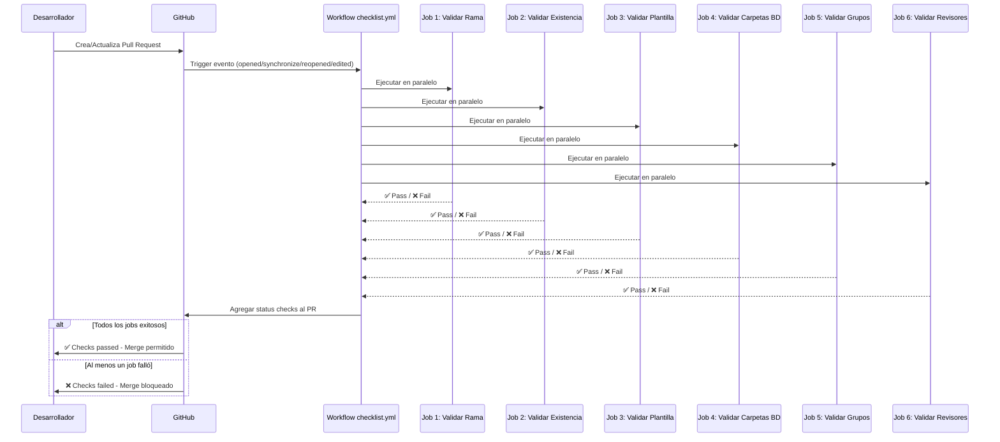

# Documentación Técnica del Workflow checklist.yml

> **Versión del Documento**: 2.0  
> **Última Actualización**: Octubre 2025  
> **Workflow Version**: checklist.yml v1.0  
> **Responsable**: Equipo ESB/ACE

## Resumen Ejecutivo

El workflow `checklist.yml` es un sistema automatizado de validación continua que garantiza el cumplimiento de estándares de documentación, configuración y gobernanza para servicios ESB/ACE12 desplegados en IBM Integration Bus (IIB) / App Connect Enterprise (ACE). Este workflow implementa 6 jobs de validación independientes que se ejecutan en paralelo, validando más de 40 reglas críticas de negocio y técnicas.

### Objetivos del Workflow
1. **Garantizar calidad documental**: Validar que toda la documentación técnica esté completa, actualizada y siga la plantilla corporativa
2. **Prevenir errores de configuración**: Detectar discrepancias entre la documentación y las configuraciones reales antes del despliegue
3. **Asegurar gobernanza**: Aplicar políticas de revisión y aprobación según el ambiente de destino
4. **Proteger información sensible**: Prevenir la inclusión accidental de datos confidenciales en el repositorio
5. **Facilitar auditoría**: Mantener trazabilidad completa de cambios y despliegues

### Arquitectura de Validación

```
┌─────────────────────────────────────────────────────────────────┐
│                    GitHub Pull Request Event                     │
│           (opened, synchronize, reopened, edited)                │
└────────────────────────┬────────────────────────────────────────┘
                         │
                         ▼
          ┌──────────────────────────────────────┐
          │  Activación de Workflow checklist.yml │
          └──────────────────────────────────────┘
                         │
                         ▼
┌────────────────────────────────────────────────────────────────────┐
│                   Ejecución Paralela de Jobs                        │
│                                                                     │
│  ┌──────────────┐  ┌──────────────┐  ┌──────────────────┐        │
│  │ Validar      │  │ Validar      │  │ Validar          │        │
│  │ Nombre       │  │ Existencia   │  │ Plantilla        │        │
│  │ Rama         │  │ README.md    │  │ README           │        │
│  └──────┬───────┘  └──────┬───────┘  └────────┬─────────┘        │
│         │                  │                    │                  │
│  ┌──────▼───────┐  ┌──────▼───────┐  ┌────────▼─────────┐        │
│  │ Validar      │  │ Validar      │  │ Validar          │        │
│  │ Carpetas     │  │ Grupos de    │  │ Rutas y          │        │
│  │ BD           │  │ Ejecución    │  │ Revisores        │        │
│  └──────────────┘  └──────────────┘  └──────────────────┘        │
│                                                                     │
└────────────────────────────┬───────────────────────────────────────┘
                             │
                             ▼
                  ┌──────────────────────┐
                  │ ¿Todos los Jobs OK?  │
                  └──────┬───────────────┘
                         │
              ┌──────────┴──────────┐
              ▼                     ▼
         ┌─────────┐         ┌──────────┐
         │ SUCCESS │         │ FAILURE  │
         │ ✅ Merge │         │ ❌ Block  │
         │ Permitido│         │ Merge    │
         └─────────┘         └──────────┘
```

### Métricas de Validación

| Job | Reglas Validadas | Tiempo Promedio | Criticidad |
|-----|------------------|-----------------|------------|
| Validar Nombre Rama | 1 | 5-10s | Alta |
| Validar Existencia README | 1 | 5-10s | Crítica |
| Validar Plantilla README | 38+ | 15-30s | Crítica |
| Validar Carpetas BD | 1 | 5-15s | Crítica |
| Validar Grupos Ejecución | 3 | 20-40s | Crítica |
| Validar Rutas y Revisores | 3 | 10-20s | Alta |

**Total**: ~46+ validaciones en 60-125 segundos (ejecución paralela)

## Tabla de Contenidos
- [Resumen Ejecutivo](#resumen-ejecutivo)
- [Arquitectura de Validación](#arquitectura-de-validación)
- [Descripción General](#descripción-general)
- [Activadores del Workflow](#activadores-del-workflow)
- [Configuración y Requisitos](#configuración-y-requisitos)
- [Jobs y Validaciones Detalladas](#jobs-y-validaciones-detalladas)
  - [1. Validar Nombre de Rama](#1-validar-nombre-de-rama)
  - [2. Validar Existencia README.md](#2-validar-existencia-readmemd)
  - [3. Validar Plantilla README](#3-validar-plantilla-readme)
  - [4. Validar Carpetas BD](#4-validar-carpetas-bd)
  - [5. Validar Grupos de Ejecución](#5-validar-grupos-de-ejecución)
  - [6. Validar Rutas y Revisores](#6-validar-rutas-y-revisores)
- [Flujos de Ejecución](#flujos-de-ejecución)
- [Reglas de Negocio](#reglas-de-negocio)
- [Reglas Específicas por Sección](#reglas-específicas-por-sección)
- [Ejemplos de Validación](#ejemplos-de-validación)
- [Troubleshooting y Resolución de Errores](#troubleshooting-y-resolución-de-errores)
- [Mejores Prácticas](#mejores-prácticas)
- [Mantenimiento del Workflow](#mantenimiento-del-workflow)

## Descripción General

El workflow `checklist.yml` es un componente crítico del pipeline de CI/CD para servicios ESB/ACE12. Se ejecuta automáticamente en Pull Requests para validar que la documentación y estructura del repositorio cumplan con los estándares definidos por la arquitectura empresarial del Banco de Occidente.

### Propósito Técnico

Este workflow implementa un patrón de **validación por capas** que garantiza:
- **Capa 1 - Estructural**: Validación de nombres de ramas y existencia de archivos críticos
- **Capa 2 - Documental**: Validación exhaustiva del contenido y formato del README.md
- **Capa 3 - Seguridad**: Prevención de inclusión de datos sensibles
- **Capa 4 - Configuración**: Sincronización entre documentación y configuraciones centrales
- **Capa 5 - Gobernanza**: Aplicación de políticas de revisión y aprobación

### Tecnologías y Herramientas

- **Plataforma**: GitHub Actions
- **Runtime**: Ubuntu Latest (ubuntu-latest runner)
- **Lenguaje de Scripting**: Bash Shell con expresiones regulares PCRE (Perl-Compatible)
- **Herramientas CLI**: 
  - `grep` con soporte PCRE (-P flag)
  - `awk` para procesamiento de texto estructurado
  - `sed` para transformaciones de texto
  - `curl` para consumo de APIs REST
  - GitHub CLI (`gh`) para interacción con GitHub API
- **APIs Consumidas**:
  - GitHub REST API v3 (para descarga de configuraciones)
  - GitHub GraphQL API (para consulta de revisores)

## Activadores del Workflow

### Eventos Disparadores

El workflow se activa automáticamente en los siguientes eventos de Pull Request:

```yaml
on:
  pull_request:
    branches:
      - main
      - develop
      - quality
      - 'feature/**'
    types:
      - opened        # PR recién creado
      - synchronize   # Nuevos commits en el PR
      - reopened      # PR reabierto
      - edited        # Cambios en título/descripción del PR
```

### Matriz de Activación

| Evento | Descripción | Casos de Uso |
|--------|-------------|--------------|
| `opened` | Se crea un nuevo Pull Request | Validación inicial al crear un PR desde cualquier rama |
| `synchronize` | Se agregan commits a un PR existente | Re-validación después de correcciones o nuevos cambios |
| `reopened` | Se reabre un PR previamente cerrado | Re-validación completa al reactivar un PR |
| `edited` | Se edita el título o descripción del PR | Actualización de validaciones que dependen de metadata del PR |

### Ramas Objetivo

El workflow valida Pull Requests dirigidos a las siguientes ramas:

| Rama | Propósito | Validaciones Especiales |
|------|-----------|------------------------|
| `main` | Producción | Requiere revisores autorizados desde `quality` |
| `develop` | Desarrollo | Permite excepción de emergencia desde `feature/**` |
| `quality` | Calidad/QA | Requiere revisores autorizados desde `develop` |
| `feature/**` | Features en desarrollo | Sin restricciones de revisores |

### Contexto de GitHub Actions

El workflow tiene acceso a los siguientes contextos:

```yaml
github.head_ref          # Rama origen del PR
github.base_ref          # Rama destino del PR
github.event.pull_request.number
github.event.pull_request.requested_reviewers[*].login
github.repository        # Formato: owner/repo
```

## Configuración y Requisitos

### Secrets Requeridos

El workflow requiere los siguientes secrets configurados a nivel de repositorio u organización:

| Secret | Propósito | Scope | Permisos Necesarios |
|--------|-----------|-------|---------------------|
| `ESB_ACE12_ORG_REPO_TOKEN` | Acceso al repositorio de configuraciones centrales | repo | `contents:read` en `bocc-principal/ESB_ACE12_General_Configs` |
| `GITHUB_TOKEN` | Acceso a GitHub API (auto-provisto) | Automático | `pull_requests:read`, `issues:read` |

### Configuración del Token de Organización

Para que el job de validación de grupos de ejecución funcione correctamente:

1. **Crear Personal Access Token (PAT)**:
   - Ir a GitHub Settings → Developer settings → Personal access tokens
   - Generar token con scope `repo` (Full control of private repositories)
   - Copiar el token generado

2. **Configurar Secret**:
   ```bash
   # A nivel de organización (recomendado)
   Settings → Secrets and variables → Actions → New organization secret
   Name: ESB_ACE12_ORG_REPO_TOKEN
   Value: <tu_token>
   Repository access: Selected repositories (incluir todos los repos ESB)
   
   # A nivel de repositorio (alternativa)
   Repository Settings → Secrets and variables → Actions → New repository secret
   Name: ESB_ACE12_ORG_REPO_TOKEN
   Value: <tu_token>
   ```

### Repositorios Externos Referenciados

| Repositorio | URL | Archivo Consumido | Propósito |
|-------------|-----|-------------------|-----------|
| `bocc-principal/ESB_ACE12_General_Configs` | Private repo | `ace-12-common-properties/esb-ace12-general-integration-servers.properties` | Configuración centralizada de grupos de ejecución |

### Requisitos del Entorno

- **Sistema Operativo**: Ubuntu Latest (linux-x64)
- **Herramientas CLI Pre-instaladas**: git, bash, grep, awk, sed, curl
- **Herramientas Instaladas por el Workflow**: GitHub CLI (`gh`)
- **Recursos del Runner**:
  - 2 CPU cores
  - 7 GB RAM
  - 14 GB SSD storage
  - Timeout por job: 360 minutos (6 horas, configurable)

## Jobs y Validaciones Detalladas

Los siguientes 6 jobs se ejecutan en **paralelo** de manera independiente. Cada job tiene su propia instancia de runner y puede fallar/pasar independientemente de los otros. El PR solo se puede fusionar si **todos los jobs pasan exitosamente**.

### 1. Validar Nombre de Rama

**Job Name**: `validar_nombre_rama`  
**Runner**: `ubuntu-latest`  
**Tiempo Estimado**: 5-10 segundos  
**Dependencias**: Ninguna

#### Propósito Técnico

Garantizar que las ramas sigan la convención de nomenclatura GitFlow adaptada, facilitando:
- Identificación automática del tipo de cambio (feature/bugfix/hotfix/release)
- Aplicación de políticas diferenciadas según el tipo de rama
- Integración con herramientas de gestión de proyectos (JIRA, Azure DevOps)
- Trazabilidad en reportes y métricas de desarrollo

#### Reglas de Validación

**Expresión Regular Aplicada**:
```regex
^(feature|bugfix|hotfix|release)\/[A-Za-z0-9._-]+$
```

**Componentes de la Regex**:
- `^` - Inicio de cadena
- `(feature|bugfix|hotfix|release)` - Prefijo obligatorio (exactamente uno de estos)
- `\/` - Separador barra diagonal literal
- `[A-Za-z0-9._-]+` - Uno o más caracteres alfanuméricos, puntos, guiones bajos o guiones
- `$` - Fin de cadena

**Tabla de Prefijos**:

| Prefijo | Propósito | Política de Merge | Ejemplo |
|---------|-----------|-------------------|---------|
| `feature/` | Nueva funcionalidad | develop → quality → main | `feature/credito-rotativo` |
| `bugfix/` | Corrección de error no crítico | develop → quality → main | `bugfix/validacion-campos` |
| `hotfix/` | Corrección urgente en producción | main (directo o desde quality) | `hotfix/error-critico-calculo` |
| `release/` | Preparación de release | quality → main | `release/v1.2.3` |

#### Implementación Técnica

```bash
# Línea 24-31 de checklist.yml
if [[ ! "${{ github.head_ref }}" =~ ^(feature|bugfix|hotfix|release)\/[A-Za-z0-9._-]+$ ]]; then
  echo "::error title=Validación de nombre de rama::Nombre de rama inválido..."
  exit 1
else
  echo "::notice title=Validación de nombre de rama::Nombre de rama válido."
fi
```

#### Ejemplos de Validación

**✅ Nombres Válidos**:
```
feature/nueva-funcionalidad
feature/JIRA-1234-implementacion
bugfix/correccion-validacion
bugfix/fix_calculation_error
hotfix/error-critico
hotfix/PROD-5678_urgent_fix
release/v1.2.3
release/2024.10.1
feature/credito_rotativo.v2
```

**❌ Nombres Inválidos y Razones**:
```bash
# Sin prefijo válido
nueva-funcionalidad              # Falta prefijo
feat/nueva-funcionalidad         # Prefijo incorrecto (debe ser 'feature')

# Prefijo solo
feature/                          # Falta nombre después del /
bugfix/                          # Falta descripción

# Caracteres no permitidos
feature/nueva funcionalidad      # Espacio no permitido
feature/nueva@funcionalidad      # @ no permitido
hotfix/fix#123                   # # no permitido

# Múltiples barras
feature/subfeature/implementacion # Barras adicionales no permitidas
```

#### Mensajes de Error

**Error emitido**:
```
::error title=Validación de nombre de rama::Nombre de rama inválido. 
Debe comenzar con 'feature/', 'bugfix/', 'hotfix/' o 'release/'.
```

**Formato del mensaje**:
- `::error` - Nivel de severidad (genera anotación de error en GitHub)
- `title=...` - Título mostrado en la UI de GitHub Actions
- Mensaje descriptivo con guía de corrección

#### Casos Especiales

1. **Ramas protegidas (main, develop, quality)**:
   - No se validan nombres (son ramas base del repositorio)
   - No pueden ser origen de PR (solo destino)

2. **Ramas legacy existentes**:
   - Si el repositorio tiene ramas con nombres antiguos, no se requiere renombrarlas
   - La validación solo aplica a ramas nuevas usadas como origen de PR

#### Código de Salida

- `exit 0` - Rama válida (continúa workflow)
- `exit 1` - Rama inválida (falla el job, bloquea merge)

### 2. Validar Existencia README.md

**Job Name**: `validar_readme_existencia`  
**Runner**: `ubuntu-latest`  
**Tiempo Estimado**: 5-10 segundos  
**Dependencias**: Ninguna

#### Propósito Técnico

Verificar la presencia del archivo de documentación principal del proyecto. El README.md es:
- **Contrato de documentación**: Define la interfaz del servicio, endpoints y configuraciones
- **Fuente única de verdad**: Utilizado por equipos de operaciones, soporte y desarrollo
- **Requisito de auditoría**: Mandatorio para cumplimiento normativo
- **Entrada para automatizaciones**: Varias herramientas parsean el README para extrar configuraciones

#### Reglas de Validación

**Validación Aplicada**:
```bash
if [ ! -f README.md ]; then
  echo "::error title=Validación de README.md::No se encontró el archivo README.md"
  exit 1
fi
```

**Criterios**:
- ✅ Debe existir un archivo llamado exactamente `README.md` (case-sensitive)
- ✅ Debe estar en la raíz del repositorio (path: `./README.md`)
- ✅ Debe ser un archivo regular (no link simbólico, no directorio)
- ❌ Falla si el archivo está en subdirectorio (`./docs/README.md` no es válido)
- ❌ Falla si el nombre tiene diferente capitalización (`readme.md`, `Readme.md`, `README.MD`)

#### Casos Especiales

1. **README vacío**: Pasa esta validación pero fallará en "Validar Plantilla README"
2. **Múltiples READMEs**: Solo se valida `./README.md` raíz; archivos en subdirectorios son ignorados
3. **README.md en .gitignore**: Si está ignorado, el archivo no existe en el checkout y fallará

#### Mensajes de Resultado

**Success**:
```
::notice title=Validación de README.md::Archivo README.md encontrado.
```

**Error**:
```
::error title=Validación de README.md::No se encontró el archivo README.md
```

#### Código de Salida

- `exit 0` - Archivo existe (continúa workflow)
- `exit 1` - Archivo no existe (falla el job, bloquea merge)

### 3. Validar Plantilla README

Este es el job más completo que valida la estructura y contenido del README.md según la plantilla estándar.

#### 3.1. Título Principal del Servicio

**Reglas**:
- Debe comenzar con `# ESB_`
- **IMPORTANTE**: Debe contener texto descriptivo después de `ESB_`
- No puede ser solo `ESB_` o `ESB_` seguido únicamente de guiones o guiones bajos
- Debe terminar con un punto (.)

**Formato esperado**: `# ESB_ACE12_NombreServicio.` o `# ESB_NombreServicio.`

**Ejemplos válidos**:
```markdown
# ESB_ACE12_UtilizacionCreditoRotativoPlus.
# ESB_ConsultaSaldos.
# ESB_ProcesoPagos.
```

**Ejemplos inválidos**:
```markdown
# ESB_.
# ESB___.
# ESB_---.
# Servicio de Consulta
```

#### 3.2. Sección INFORMACIÓN DEL SERVICIO

**Reglas**:
- Debe existir el encabezado `## INFORMACIÓN DEL SERVICIO`
- **IMPORTANTE**: Debe contener información descriptiva del servicio **antes** de cualquier subsección (como `### Último despliegue`)
- La descripción no puede estar vacía

**Estructura esperada**:
```markdown
## INFORMACIÓN DEL SERVICIO

[Aquí debe ir la descripción del servicio con al menos un párrafo explicando su funcionalidad]

### Último despliegue
...
```

**Ejemplos válidos**:
```markdown
## INFORMACIÓN DEL SERVICIO

El presente documento expone de manera detallada la funcionalidad y componentes del flujo...

### Último despliegue
```

**Ejemplos inválidos**:
```markdown
## INFORMACIÓN DEL SERVICIO

### Último despliegue
```

#### 3.3. Subsección Último Despliegue

**Reglas**:
- Debe existir la subsección `### Último despliege` (note: con la ortografía actual del template)
- Debe contener una tabla con el encabezado: `|CQ |JIRA | Fecha|`
- La tabla debe tener al menos una fila de datos después del separador `|---|---|---|`
- Todas las celdas deben tener valores (puede ser 'NA' si no aplica)
- No puede haber celdas vacías

**Formato esperado**:
```markdown
### Último despliege

|CQ |JIRA | Fecha|
|---|---|---|
| NA | NA |6/10/2023 (WS) |
```

#### 3.4. Sección Procedimiento de Despliegue

**Reglas**:
- Debe existir el encabezado `## Procedimiento de despliegue`
- Debe contener instrucciones de despliegue (no puede estar vacía)
- Case-insensitive para el título

**Ejemplo válido**:
```markdown
## Procedimiento de despliegue

Aplicar UtilizacionCreditoRotativoPlus.properties a UtilizacionCreditoRotativoPlus.bar y desplegar en los grupos de ejecución:
BOGESERVICIOSWS05_SRV01 BOGESERVICIOSWS05_SRV02
```

#### 3.5. Sección ACCESO AL SERVICIO

##### 3.5.1. DataPower (Interno/Externo)

**Reglas principales**:

1. **Encabezado obligatorio**: 
   - Debe existir al menos una de las subsecciones: `### DataPower Interno :` o `### DataPower Externo :`
   - Si ninguna está presente, se lanza un **warning** (no error) recomendando indicar explícitamente con 'NA'

2. **Contenido no vacío**:
   - Si el encabezado existe, **no puede estar vacío**
   - Como mínimo debe contener una de las siguientes formas si no aplica:
     - "NA"
     - "N/A"
     - "No Aplica"
   - Si contiene una tabla, **debe tener al menos una fila de datos** (no solo el encabezado y separador)
   - Se reporta **error** si la tabla está vacía o no tiene filas de datos

3. **Validación de URLs**:
   - **CRÍTICO**: Las URLs de DataPower deben comenzar con `https://boc201` 
   - **NO se permite**: URLs que comiencen con `https://boc200`
   - Debe cumplir con el formato específico por ambiente (ver tabla abajo)

**Ejemplos válidos de DataPower**:

```markdown
### DataPower Interno :
|AMBIENTE|TIPO COMPONENTE|NOMBRE WSP O MPG|DATAPOWER|ENDPOINT|
|---|---|---|---|---|
|DESARROLLO|WSP|WSServicioInterno|BODPDEV|https://boc201.des.app.bancodeoccidente.net:4806/Servicio/Port|
|CALIDAD|WSP|WSServicioInterno|BODPQAS|https://boc201.testint.app.bancodeoccidente.net:4806/Servicio/Port|
|PRODUCCION|WSP|WSServicioInterno|BODPPRD|https://boc201.prdint.app.bancodeoccidente.net:4806/Servicio/Port|
```

```markdown
### DataPower Interno :
NA
```

```markdown
### DataPower Interno :
N/A
```

```markdown
### DataPower Interno :
No Aplica
```

```markdown
### DataPower Externo :
NA

### DataPower Interno :
NA
```

**Ejemplos inválidos de DataPower**:

```markdown
### DataPower Interno :
|AMBIENTE|TIPO COMPONENTE|NOMBRE WSP O MPG|DATAPOWER|ENDPOINT|
|---|---|---|---|---|


```
❌ Error: Tabla con encabezado pero sin filas de datos

```markdown
### DataPower Interno :
|AMBIENTE|TIPO COMPONENTE|NOMBRE WSP O MPG|DATAPOWER|ENDPOINT|
|---|---|---|---|---|
|DESARROLLO|WSP|WSServicio|BODPDEV|https://boc200.des.app.bancodeoccidente.net:4806/Servicio/Port|
```
❌ Error: URL con boc200 (debe ser boc201)

```markdown
## ACCESO AL SERVICIO

### Endpoint BUS
...
```
⚠️ Warning: No se encontró ninguna subsección DataPower

##### 3.5.2. Validaciones de Formato de URLs DataPower

**Por Ambiente y Tipo**:

| Ambiente | DataPower | Endpoint Interno | Endpoint Externo |
|----------|-----------|------------------|------------------|
| DESARROLLO | BODP*DEV | https://boc201.des.app.bancodeoccidente.net | N/A para externo en DEV |
| CALIDAD | BODP*QAS | https://boc201.testint.app.bancodeoccidente.net | https://boc201.testdmz.app.bancodeoccidente.net |
| PRODUCCION | BODP*PRD | https://boc201.prdint.app.bancodeoccidente.net | https://boc201.prddmz.app.bancodeoccidente.net |

**Validaciones adicionales**:
- El nombre del DataPower debe comenzar con `BODP` y terminar con `DEV`, `QAS` o `PRD` según el ambiente
- Deben existir filas para los 3 ambientes (DESARROLLO, CALIDAD, PRODUCCION)
- Si una tabla tiene todos los valores en NA, la otra tabla también debe tener todos en NA

##### 3.5.3. Endpoint BUS

**Reglas**:
- Debe existir la subsección `### Endpoint BUS`
- Debe contener una tabla con endpoints para los 3 ambientes
- **No puede contener valores NA** (a diferencia de DataPower)
- Los endpoints deben cumplir con el formato por ambiente

**Formatos esperados por ambiente**:

| Ambiente | Formato URL |
|----------|-------------|
| DESARROLLO | https://adbog162e.bancodeoccidente.net:XXXX/... |
| CALIDAD | https://a[dt]bog16[34][de].bancodeoccidente.net:XXXX/... |
| PRODUCCION | https://adbog16[56][ab].bancodeoccidente.net:XXXX/... o https://boc060ap.prd.app.bancodeoccidente.net:XXXX/... |

#### 3.6. Sección CANALES - APLICACIONES

**Reglas**:
- Debe existir el encabezado `## CANALES - APLICACIONES`
- Debe contener contenido (no puede estar vacía)
- Debe tener una fila `**Consumidor**` con valores
- Debe tener una fila `**Backends**` con valores
- Ambas filas pueden contener 'NA' si no aplica, pero no pueden estar vacías

**Formato esperado**:
```markdown
## CANALES - APLICACIONES

|||||
|---|---|---|---|
|**Consumidor**|CANALES|PB|IVR|

|||||
|---|---|---|---|
|**Backends**|NA|||
```

#### 3.7. Sección DEPENDENCIAS

**Reglas**:
- Debe existir el encabezado `## DEPENDENCIAS`
- Debe contener dos tablas: `Servicios` y `XSL`

##### 3.7.1. Tabla Servicios

**Reglas**:
- Debe contener la lista de servicios (proyectos) que son dependencias
- Los servicios listados deben coincidir con los proyectos declarados en el archivo `.project`
- Se valida sincronización entre README y archivo `.project`

**Validaciones**:
- ✅ Servicios en `.project` deben estar en README
- ✅ Servicios en README deben existir en `.project`
- ❌ Error si hay discrepancias

##### 3.7.2. Tabla XSL

**Reglas**:
- Debe existir la tabla `|XSL|`
- Si no hay XSLs a consumir, debe indicarse explícitamente con 'NA'
- No puede estar vacía

**Ejemplos**:
```markdown
|XSL|
|---|
|REQ_ACOperacion_017.xsl|
|REQ_ACOperacion_277.xsl|
```

o

```markdown
|XSL|
|---|
|NA|
```

#### 3.8. Sección DOCUMENTACION

**Reglas**:
- Debe existir el encabezado `## DOCUMENTACION`
- Debe contener los siguientes campos con enlaces válidos:

##### 3.8.1. Campo "Documento de diseño detallado"

**Formato**: `**Documento de diseño detallado:**`
- Debe tener un enlace que comience con `https://bancoccidente.sharepoint.com/:f:/r/sites/BibliotecaAplicaciones/`

##### 3.8.2. Campo "Mapeo"

**Formato**: `**Mapeo:**`
- Debe tener un enlace que comience con `https://bancoccidente.sharepoint.com/:f:/r/sites/BibliotecaAplicaciones/`

##### 3.8.3. Campo "Evidencias"

**Formato**: `**Evidencias (Unitarias/Auditoria/Monitoreo):**`
- Debe tener un enlace que comience con `https://bancoccidente.sharepoint.com/:f:/r/sites/BibliotecaAplicaciones/`

##### 3.8.4. Campo "WSDL"

**Formato**: `**WSDL:**`
- Debe contener la ruta del WSDL en formato: `git\{NOMBRE_REPO}\Broker\WSDL\wsdl\{archivo}.wsdl`
- El `{NOMBRE_REPO}` debe coincidir con el nombre del repositorio extraído del título
- Alternativamente, puede contener solo 'NA' o 'N/A' si no aplica

**Ejemplo**:
```markdown
**WSDL:** <br>
git\ESB_ACE12_UtilizacionCreditoRotativoPlus\Broker\WSDL\wsdl\UtililzacionCreditoRotativoPlus.wsdl
```

#### 3.9. Sección SQL

**Reglas**:
- Debe existir el encabezado `## SQL`
- Debe contener queries SQL para auditoría y monitoreo
- No puede estar vacía
- Los códigos de operación en las queries deben ser **solo números** (sin letras)
- **No se permiten códigos de operación vacíos** (`num_id_tipo_operacion = ''`)

**Validaciones de códigos de operación**:
- En formato `where ... = '123'`: el valor debe contener solo dígitos y no puede estar vacío
- En formato `where ... in('123','456')`: todos los valores deben ser solo dígitos
- ❌ Error si se encuentran letras en los códigos de operación
- ❌ Error si se encuentra un código de operación vacío (`= ''`)

**Nota sobre subsecciones FILTRAR**: Las subsecciones que comienzan con "Filtrar" (como "Filtrar por Codigo de Operacion") **son validadas** y deben cumplir con las mismas reglas.

**Ejemplo válido**:
```sql
select * from admesb.esb_log_auditoria where num_id_tipo_operacion = '99042'
```

**Ejemplos inválidos**:
```sql
select * from admesb.esb_log_auditoria where num_id_tipo_operacion = ''
```
❌ Error: código de operación vacío

```sql
select * from admesb.esb_log_auditoria where num_id_tipo_operacion = '99a9042'
```
❌ Error: código contiene letra 'a'

### 4. Validar Carpetas BD

**Propósito**: Evitar la inclusión de carpetas con información sensible de base de datos.

**Reglas**:
- No debe existir ninguna carpeta llamada "BD" (case-insensitive) en el repositorio
- Se excluye la carpeta `.git` de la búsqueda

**Resultado**:
- ❌ Error si se encuentra alguna carpeta BD
- ✅ Success si no se encuentran carpetas BD

### 5. Validar Grupos de Ejecución

**Propósito**: Verificar que los grupos de ejecución documentados coincidan con la configuración central.

**Reglas**:
1. Extrae el nombre del servicio del título del README (formato `ESB_ACE12_{Servicio}`)
2. Busca en el README la línea "desplegar en los grupos de ejecución:"
3. Extrae los grupos listados (pueden estar en la misma línea o en la siguiente)
4. Descarga el archivo `esb-ace12-general-integration-servers.properties` del repositorio central
5. Compara los grupos del README con los del archivo de configuración

**Validaciones**:
- ✅ Los grupos deben coincidir exactamente (sin importar orden ni uso de comas)
- ❌ Error si hay grupos en README que no están en config
- ❌ Error si hay grupos en config que no están en README

**Requisito**: Requiere el secret `ESB_ACE12_ORG_REPO_TOKEN` para acceder al repositorio de configuración.

### 6. Validar Rutas y Revisores

**Propósito**: Asegurar que los Pull Requests tengan los revisores apropiados según la ruta de despliegue.

**Reglas**:

#### 6.1. Ruta develop → quality
- Debe tener al menos un revisor de la lista de autorizados
- Revisores válidos: `DRamirezM`, `cdgomez`, `acardenasm`, `CAARIZA`

#### 6.2. Ruta quality → main
- Debe tener al menos un revisor de la lista de autorizados
- Revisores válidos: `DRamirezM`, `cdgomez`, `acardenasm`, `CAARIZA`

#### 6.3. Excepción de Emergencia
- Para rutas feature/** → develop, existe una excepción manual
- Si un comentario en el PR contiene el texto `@bot aprobar excepción`, se permite el merge sin revisor
- Esta excepción solo aplica para emergencias

## Reglas Específicas por Sección

### Resumen de Reglas DataPower

| Escenario | Regla | Resultado |
|-----------|-------|-----------|
| Sin secciones DataPower | Ninguna subsección presente | ⚠️ Warning - Recomendar indicar NA explícitamente |
| Solo DataPower Interno | Con tabla de endpoints | ✅ Válido |
| Solo DataPower Externo | Con tabla de endpoints | ✅ Válido |
| DataPower Interno | Encabezado presente, contenido vacío | ❌ Error |
| DataPower con NA | Encabezado presente, contenido "NA" | ✅ Válido |
| Ambas secciones | Ambas con NA | ✅ Válido |
| Ambas secciones | Una con tabla, otra vacía | ❌ Error |
| URL con boc200 | Cualquier URL con https://boc200 | ❌ Error |
| URL con boc201 | URLs correctas con https://boc201 | ✅ Válido |

### Resumen de Validaciones de URLs

| Componente | Patrón Requerido | Error si contiene |
|------------|------------------|-------------------|
| DataPower Desarrollo | https://boc201.des.app.bancodeoccidente.net | https://boc200 |
| DataPower Calidad Interno | https://boc201.testint.app.bancodeoccidente.net | https://boc200 |
| DataPower Calidad Externo | https://boc201.testdmz.app.bancodeoccidente.net | https://boc200 |
| DataPower Producción Interno | https://boc201.prdint.app.bancodeoccidente.net | https://boc200 |
| DataPower Producción Externo | https://boc201.prddmz.app.bancodeoccidente.net | https://boc200 |

## Ejemplos de Validación

### Ejemplo 1: README Completo Válido con DataPower

```markdown
# ESB_ACE12_MiServicio.

## INFORMACIÓN DEL SERVICIO

Este servicio implementa la funcionalidad de consulta de saldos para clientes...

### Último despliege

|CQ |JIRA | Fecha|
|---|---|---|
| CQ123 | JIRA-456 |15/03/2024|

## Procedimiento de despliegue

Aplicar MiServicio.properties a MiServicio.bar y desplegar en los grupos de ejecución:
BOGESERVICIOSWS05_SRV01 BOGESERVICIOSWS05_SRV02

## ACCESO AL SERVICIO

### DataPower Interno :
|AMBIENTE|TIPO COMPONENTE|NOMBRE WSP O MPG|DATAPOWER|ENDPOINT|
|---|---|---|---|---|
|DESARROLLO|WSP|WSMiServicio|BODPDEV|https://boc201.des.app.bancodeoccidente.net:4806/MiServicio/Port|
|CALIDAD|WSP|WSMiServicio|BODPQAS|https://boc201.testint.app.bancodeoccidente.net:4806/MiServicio/Port|
|PRODUCCION|WSP|WSMiServicio|BODPPRD|https://boc201.prdint.app.bancodeoccidente.net:4806/MiServicio/Port|

### Endpoint BUS
[tabla de endpoints...]

## CANALES - APLICACIONES
[contenido...]

## DEPENDENCIAS
[contenido...]

## DOCUMENTACION
[contenido...]

## SQL
[contenido...]
```

**Resultado**: ✅ Todas las validaciones pasan

### Ejemplo 2: README con DataPower NA (Válido)

```markdown
# ESB_ACE12_ServicioSinDataPower.

## INFORMACIÓN DEL SERVICIO

Este servicio no requiere acceso a DataPower...

### Último despliege
[tabla...]

## PROCEDIMIENTO DE DESPLIEGUE
[contenido...]

## ACCESO AL SERVICIO

### DataPower Interno :
NA

### DataPower Externo :
NA

### Endpoint BUS
[tabla de endpoints...]
```

**Resultado**: ✅ Todas las validaciones pasan

### Ejemplo 3: README con Error en Título

```markdown
# ESB_.

## INFORMACIÓN DEL SERVICIO
[contenido...]
```

**Resultado**: ❌ Error - "El título no puede ser solo 'ESB_'"

### Ejemplo 4: README con DataPower Vacío (Inválido)

```markdown
# ESB_ACE12_ServicioConErrores.

## INFORMACIÓN DEL SERVICIO
[contenido...]

## ACCESO AL SERVICIO

### DataPower Interno :
|AMBIENTE|TIPO COMPONENTE|NOMBRE WSP O MPG|DATAPOWER|ENDPOINT|
|---|---|---|---|---|


```

**Resultado**: ❌ Error - "No se encontraron filas de datos en tabla DataPower Interno"

### Ejemplo 5: README con SQL Inválido

```markdown
## SQL
Filtrar por Codigo de Operacion
```
select * from admesb.esb_log_auditoria where num_id_tipo_operacion = ''
select * from admesb.esb_log_auditoria where num_id_tipo_operacion = '99a9042'
```
```

**Resultado**: 
- ❌ Error - "Código de operación está vacío (num_id_tipo_operacion = '')"
- ❌ Error - "Código de operación contiene caracteres no numéricos"

### Ejemplo 6: README con URL Incorrecta (Inválido)

```markdown
### DataPower Interno :
|AMBIENTE|TIPO COMPONENTE|NOMBRE WSP O MPG|DATAPOWER|ENDPOINT|
|---|---|---|---|---|
|DESARROLLO|WSP|WSMiServicio|BODPDEV|https://boc200.des.app.bancodeoccidente.net:4806/MiServicio/Port|
```

**Resultado**: ❌ Error - "Los endpoints de DataPower deben comenzar con 'https://boc201' (NO 'https://boc200')"

### Ejemplo 7: README Sin Información Descriptiva

```markdown
# ESB_ACE12_MiServicio.

## INFORMACIÓN DEL SERVICIO

### Último despliege
[tabla...]
```

**Resultado**: ❌ Error - "La sección '## INFORMACIÓN DEL SERVICIO' no contiene información descriptiva antes de las subsecciones"

## Notas Importantes

1. **Case Sensitivity**: Algunas validaciones son case-sensitive (como los nombres de archivo) y otras no (como algunos títulos de sección).

2. **Orden de Secciones**: El orden de las secciones debe seguir la plantilla estándar.

3. **Formato de Tablas**: Las tablas deben usar el formato Markdown estándar con separadores `|`.

4. **URLs**: Las URLs deben ser completas y comenzar con `https://` (excepto donde se indique lo contrario).

5. **Valores NA**: Cuando se use para indicar que no aplica, se aceptan las siguientes formas: 'NA', 'N/A', o 'No Aplica'.

6. **DataPower**: Esta es una de las validaciones más críticas y con más reglas específicas - prestar especial atención a:
   - No dejar secciones vacías
   - Usar siempre `https://boc201` (nunca `boc200`)
   - Incluir al menos una subsección o indicar explícitamente NA en ambas

## Troubleshooting y Resolución de Errores

Esta sección proporciona una guía completa de resolución de problemas, organizada por job y tipo de error.

### Matriz de Errores Comunes

| Código Error | Job | Descripción | Severidad | Tiempo Resolución |
|--------------|-----|-------------|-----------|-------------------|
| ERR-J1-001 | 1 | Nombre de rama inválido | Alta | 2-5 min |
| ERR-J2-001 | 2 | README.md no existe | Crítica | 1 min |
| ERR-J3-001 | 3 | Título incorrecto | Alta | 2 min |
| ERR-J3-002 | 3 | Sección vacía | Alta | 5-10 min |
| ERR-J3-003 | 3 | Tabla sin datos | Media | 3-5 min |
| ERR-J3-004 | 3 | URL DataPower boc200 | Crítica | 2 min |
| ERR-J3-005 | 3 | Endpoints no coinciden con ambiente | Alta | 5 min |
| ERR-J3-006 | 3 | Código operación con letras | Crítica | 3 min |
| ERR-J3-007 | 3 | Dependencias desincronizadas | Media | 5-10 min |
| ERR-J4-001 | 4 | Carpeta BD encontrada | Crítica | 1 min |
| ERR-J5-001 | 5 | Grupos de ejecución no coinciden | Alta | 10-15 min |
| ERR-J5-002 | 5 | No se pudo descargar config | Crítica | Contactar admin |
| ERR-J6-001 | 6 | Falta revisor autorizado | Media | 2 min |

### Job 1: Validar Nombre de Rama

#### ERR-J1-001: Nombre de rama inválido

**Mensaje de Error**:
```
::error title=Validación de nombre de rama::Nombre de rama inválido. 
Debe comenzar con 'feature/', 'bugfix/', 'hotfix/' o 'release/'.
```

**Causas Comunes**:
1. Rama creada sin prefijo: `mi-nueva-funcionalidad`
2. Prefijo abreviado: `feat/` en lugar de `feature/`
3. Caracteres especiales no permitidos: `feature/nueva función` (espacio)
4. Solo prefijo sin nombre: `feature/`

**Solución Paso a Paso**:

```bash
# 1. Identificar nombre actual de la rama
git branch --show-current

# 2. Renombrar la rama localmente
git branch -m feature/nombre-descriptivo

# 3. Si ya se hizo push, eliminar rama remota antigua
git push origin --delete <nombre-antiguo>

# 4. Pushear rama con nuevo nombre
git push -u origin feature/nombre-descriptivo

# 5. Actualizar PR (GitHub lo detecta automáticamente)
```

**Nombres Válidos Recomendados**:
```bash
feature/JIRA-1234-implementar-servicio
bugfix/corregir-validacion-campos
hotfix/error-calculo-saldos
release/v1.2.3
```

**Prevención**:
- Usar herramienta de línea de comandos para crear ramas:
  ```bash
  git checkout -b feature/$(git config user.name | tr ' ' '-')-descripcion
  ```
- Configurar alias de git para validar nombres:
  ```bash
  git config alias.new-feature '!f() { git checkout -b feature/$1; }; f'
  # Uso: git new-feature implementar-servicio
  ```

### Job 2: Validar Existencia README.md

#### ERR-J2-001: README.md no existe

**Mensaje de Error**:
```
::error title=Validación de README.md::No se encontró el archivo README.md
```

**Causas Comunes**:
1. Archivo nunca creado
2. Archivo con nombre incorrecto: `readme.md`, `README.MD`, `Readme.md`
3. Archivo en subdirectorio: `docs/README.md`
4. Archivo en `.gitignore`

**Solución**:

```bash
# Verificar si existe (case-sensitive)
ls -la | grep README.md

# Si existe con nombre incorrecto, renombrar
mv readme.md README.md
# o
mv README.MD README.md

# Si está en subdirectorio, mover a raíz
mv docs/README.md ./README.md

# Si no existe, crear desde plantilla
# (obtener plantilla del equipo de arquitectura o de otro repo)
curl -o README.md https://raw.githubusercontent.com/{org}/{template-repo}/main/README.template.md

# Agregar, commit y push
git add README.md
git commit -m "Add README.md file"
git push
```

**Prevención**:
- Incluir README.md en plantilla de repositorio
- Agregar pre-commit hook que verifique existencia

### Job 3: Validar Plantilla README

#### ERR-J3-001: Título incorrecto

**Mensaje de Error**:
```
::error title=Validación de README.md::El título no puede ser solo 'ESB_' o 'ESB_' 
seguido solo de guiones. Debe agregar un nombre descriptivo del repositorio después de ESB_
```

**Solución**:
```markdown
# ❌ Incorrecto
# ESB_.
# ESB___.
# ESB_---.

# ✅ Correcto
# ESB_ACE12_UtilizacionCreditoRotativoPlus.
```

**Pasos**:
1. Abrir README.md
2. Editar línea 1
3. Formato: `# ESB_ACE12_{NombreServicio}.` (con punto final)
4. Guardar, commit, push

#### ERR-J3-002: Sección vacía

**Mensaje de Error**:
```
::error title=Validación de README.md::La sección '## INFORMACIÓN DEL SERVICIO' 
no contiene información descriptiva antes de las subsecciones.
```

**Causa**: Falta párrafo de descripción antes de `### Último despliegue`

**Solución**:
```markdown
## INFORMACIÓN DEL SERVICIO

<!-- Agregar esta descripción -->
El presente documento expone de manera detallada la funcionalidad y componentes 
del flujo {NombreServicio}. Este servicio recibe una petición desde {sistema consumidor} 
e interactúa con {sistemas backend}, finalmente devuelve una respuesta al consumidor.

### Último despliege
```

**Plantilla de Descripción**:
```
El servicio {NOMBRE} implementa {FUNCIONALIDAD_PRINCIPAL}.

**Flujo de operación**:
1. Recibe petición desde {CONSUMIDORES}
2. Valida {QUE_VALIDA}
3. Integra con {BACKENDS}
4. Retorna {QUE_RETORNA}

**Tecnologías**: IBM ACE 12, {OTRAS_TECNOLOGIAS}
**Protocolo**: {SOAP/REST/MQ}
**Versión actual**: {VERSION}
```

#### ERR-J3-003: Tabla sin datos

**Mensaje de Error**:
```
::error title=Validación de README.md::La tabla 'Último despliege' no tiene 
fila de datos. Debe incluir al menos una fila con valores o 'NA' en cada columna.
```

**Causa**: Tabla con encabezado pero sin fila de datos

**Solución**:
```markdown
### Último despliege

|CQ |JIRA | Fecha|
|---|---|---|
| NA | NA |6/10/2023 (WS) |    <!-- Agregar esta línea -->
```

**Reglas**:
- Mínimo 1 fila de datos
- Cada celda debe tener valor (puede ser "NA")
- No dejar celdas vacías: `| |NA|...|` es inválido

#### ERR-J3-004: URL DataPower boc200 (CRÍTICO)

**Mensaje de Error**:
```
::error title=Validación de README.md::Los endpoints de DataPower deben comenzar 
con 'https://boc201' (NO 'https://boc200'). Encontrado: https://boc200.des.app...
```

**Causa**: Uso de infraestructura legacy no autorizada (boc200)

**Solución URGENTE**:
```markdown
# ❌ INCORRECTO - Infraestructura legacy
https://boc200.des.app.bancodeoccidente.net:4806/...

# ✅ CORRECTO - Infraestructura autorizada
https://boc201.des.app.bancodeoccidente.net:4806/...
```

**Buscar y reemplazar en README**:
```bash
# Buscar todas las ocurrencias
grep -n "boc200" README.md

# Reemplazar todas
sed -i 's/boc200/boc201/g' README.md

# Verificar cambios
git diff README.md
```

**IMPORTANTE**: Este cambio también debe aplicarse en:
- Archivos de configuración (.properties)
- Documentación técnica
- Scripts de despliegue

#### ERR-J3-005: Endpoints no coinciden con ambiente

**Mensaje de Error**:
```
::error title=Validación de README.md::Endpoint BUS en CALIDAD debe comenzar con 
https://adbog163d.bancodeoccidente.net o https://atbog163d.bancodeoccidente.net...
```

**Causa**: URL no corresponde al ambiente especificado

**Solución** - Tabla de URLs correctas por ambiente:

**Endpoint BUS**:
```markdown
| DESARROLLO | https://adbog162e.bancodeoccidente.net:XXXX/... |
| CALIDAD    | https://atbog163d.bancodeoccidente.net:XXXX/... |
| CALIDAD    | https://adbog164e.bancodeoccidente.net:XXXX/... |
| PRODUCCION | https://adbog165a.bancodeoccidente.net:XXXX/... |
| PRODUCCION | https://adbog166b.bancodeoccidente.net:XXXX/... |
| PRODUCCION | https://boc060ap.prd.app.bancodeoccidente.net:XXXX/... |
```

**DataPower Interno**:
```markdown
| DESARROLLO | https://boc201.des.app.bancodeoccidente.net:XXXX/... |
| CALIDAD    | https://boc201.testint.app.bancodeoccidente.net:XXXX/... |
| PRODUCCION | https://boc201.prdint.app.bancodeoccidente.net:XXXX/... |
```

**DataPower Externo**:
```markdown
| CALIDAD    | https://boc201.testdmz.app.bancodeoccidente.net:XXXX/... |
| PRODUCCION | https://boc201.prddmz.app.bancodeoccidente.net:XXXX/... |
```

#### ERR-J3-006: Código de operación con letras

**Mensaje de Error**:
```
::error title=Validación de README.md::Código de operación contiene caracteres 
no numéricos. Solo se permiten números: 99a042
```

**Causa**: Código de operación incluye letras o caracteres especiales

**Solución**:
```sql
-- ❌ INCORRECTO
select * from admesb.esb_log_auditoria 
where num_id_tipo_operacion = '99a042'

-- ❌ INCORRECTO - Código vacío
select * from admesb.esb_log_auditoria 
where num_id_tipo_operacion = ''

-- ✅ CORRECTO
select * from admesb.esb_log_auditoria 
where num_id_tipo_operacion = '99042'

-- ✅ CORRECTO - Múltiples códigos
select * from admesb.esb_log_auditoria 
where num_id_tipo_operacion in ('99042', '99043', '99044')
```

**Verificación**: Consultar tabla de códigos de operación corporativa

#### ERR-J3-007: Dependencias desincronizadas

**Mensaje de Error**:
```
::error title=Validación de README.md::Servicios en .project que faltan en la 
tabla DEPENDENCIAS del README: IntegracionACCaller GeneradorSecuenciaESBCaller
```

**Causa**: La tabla de dependencias en README no refleja el archivo .project

**Solución Paso a Paso**:

```bash
# 1. Ver proyectos en archivo .project
grep -oP '<project>\K[^<]+' .project | sort

# 2. Ver servicios en README
awk '/^\|Servicios\|/,/^\|XSL\|/' README.md | grep '^\|' | grep -v '^\|---|' | cut -d'|' -f2

# 3. Identificar diferencias y actualizar README
```

**Actualizar README**:
```markdown
## DEPENDENCIAS
|Servicios|
|---|
|CacheHomologacionTipos_StaticLib|
|ConsultaCupoCarteraPaqueteCaller|
|GeneradorSecuenciaESBCaller|        <!-- Agregar faltantes -->
|IntegracionACCaller|                <!-- Agregar faltantes -->
|IntegracionFCCaller|
|IntegracionWSCaller|
|MessageSet_017_StaticLib|
|Util|
||
```

**Automatización** (script bash para generar lista):
```bash
#!/bin/bash
echo "|Servicios|"
echo "|---|"
grep -oP '<project>\K[^<]+' .project | sort | while read proj; do
  echo "|$proj|"
done
echo "||"
```

### Job 4: Validar Carpetas BD

#### ERR-J4-001: Carpeta BD encontrada

**Mensaje de Error**:
```
::error title=Validación de carpetas BD::Se encontraron carpetas 'BD' en el repositorio. 
Esto viola las políticas de información. Carpetas encontradas:
./src/BD
```

**Causa**: Inclusión accidental de carpeta con scripts de base de datos

**SOLUCIÓN INMEDIATA** (CRÍTICA):

```bash
# 1. Identificar carpetas BD
find . -type d -iname "BD" ! -path "./.git/*"

# 2. Revisar contenido (puede tener información sensible)
ls -R ./src/BD

# 3. ELIMINAR carpetas BD
rm -rf ./src/BD

# 4. Agregar a .gitignore para prevenir
echo "BD/" >> .gitignore
echo "**/BD/" >> .gitignore

# 5. Commit y push
git add .gitignore
git add -u  # Registra eliminación
git commit -m "Remove BD folders - security policy compliance"
git push
```

**IMPORTANTE - Revisión de Seguridad**:
1. ¿La carpeta contenía credenciales? → Rotar credenciales inmediatamente
2. ¿La carpeta contenía datos de clientes? → Notificar a seguridad
3. ¿Los archivos ya fueron pusheados previamente? → Limpiar historial de git

**Limpiar historial si es necesario**:
```bash
# Usar BFG Repo-Cleaner o git filter-branch
git filter-branch --force --index-filter \
  "git rm -rf --cached --ignore-unmatch src/BD" \
  --prune-empty --tag-name-filter cat -- --all

# Force push (coordinar con el equipo)
git push origin --force --all
```

### Job 5: Validar Grupos de Ejecución

#### ERR-J5-001: Grupos de ejecución no coinciden

**Mensaje de Error**:
```
::error title=Validación de grupos de ejecución::Grupos que están en README pero 
NO en config [UtilizacionCreditoRotativoPlus]:
- bogeserviciosws05_srv03
```

**Causa**: Desincronización entre README y configuración central

**Diagnóstico**:
```bash
# Ver grupos en README
grep -A 5 "desplegar en los grupos de ejecución:" README.md

# Descargar config central (requiere token)
curl -H "Authorization: Bearer $TOKEN" \
     -H "Accept: application/vnd.github.v3.raw" \
     "https://api.github.com/repos/bocc-principal/ESB_ACE12_General_Configs/contents/ace-12-common-properties/esb-ace12-general-integration-servers.properties?ref=main" \
     -o config.properties

# Ver grupos en config
grep "UtilizacionCreditoRotativoPlus" config.properties
```

**Solución - Opción 1: Actualizar README**:
```markdown
## Procedimiento de despliegue

Aplicar UtilizacionCreditoRotativoPlus.properties a UtilizacionCreditoRotativoPlus.bar 
y desplegar en los grupos de ejecución:
BOGESERVICIOSWS05_SRV01 BOGESERVICIOSWS05_SRV02
<!-- Eliminar SRV03 que no existe en config -->
```

**Solución - Opción 2: Actualizar configuración central**:
1. Crear PR en repositorio `ESB_ACE12_General_Configs`
2. Agregar entrada en `esb-ace12-general-integration-servers.properties`:
   ```properties
   ESB_ACE12_UtilizacionCreditoRotativoPlus.Transactional=BOGESERVICIOSWS05_SRV01,BOGESERVICIOSWS05_SRV02,BOGESERVICIOSWS05_SRV03
   ```
3. Esperar aprobación y merge
4. Re-ejecutar validación

**Coordinación**: Contactar arquitecto de integración para determinar cuál opción aplicar

#### ERR-J5-002: No se pudo descargar config

**Mensaje de Error**:
```
::error title=Validación de grupos de ejecución::No se pudo descargar el archivo .properties
```

**Causas**:
1. Secret `ESB_ACE12_ORG_REPO_TOKEN` no configurado
2. Token expirado o revocado
3. Permisos insuficientes en el token
4. Repositorio de configuración no accesible

**Solución - Verificar Secret**:
```bash
# En GitHub: Settings → Secrets and variables → Actions
# Verificar que existe: ESB_ACE12_ORG_REPO_TOKEN

# Verificar permisos del token:
# - repo (Full control of private repositories)
# - Acceso al repositorio bocc-principal/ESB_ACE12_General_Configs
```

**Solución - Regenerar Token**:
1. GitHub Settings → Developer settings → Personal access tokens
2. Generar nuevo token con scope `repo`
3. Actualizar secret en el repositorio
4. Re-ejecutar workflow

**Escalación**: Si el problema persiste, contactar administrador de GitHub Enterprise

### Job 6: Validar Rutas y Revisores

#### ERR-J6-001: Falta revisor autorizado

**Mensaje de Error**:
```
::error title=Validación de rutas y revisores::Falta revisor válido para calidad. 
Autorizados: DRamirezM cdgomez acardenasm CAARIZA
```

**Causa**: PR de develop → quality o quality → main sin revisor de la lista autorizada

**Solución**:
1. Ir al PR en GitHub
2. En el panel derecho, sección "Reviewers"
3. Click en ⚙️ (gear icon)
4. Agregar al menos uno de:
   - DRamirezM
   - cdgomez
   - acardenasm
   - CAARIZA
5. El workflow se re-ejecutará automáticamente

**Excepción de Emergencia** (solo para feature → develop):
```
# Agregar comentario en el PR:
@bot aprobar excepción

# El job 6 permitirá el merge
# NOTA: Usar solo en emergencias, queda registrado en auditoría
```

**Política**:
- develop → quality: REQUIERE revisor autorizado, sin excepción
- quality → main: REQUIERE revisor autorizado, sin excepción
- feature → develop: Permite excepción de emergencia

## Mejores Prácticas

### Para Desarrolladores

#### BP-DEV-001: Validar README Localmente Antes de Push

**Script de Validación Local**:
```bash
#!/bin/bash
# validate-readme.sh

echo "🔍 Validando README.md localmente..."

# Validar título
if ! grep -Pq '^# ESB_[A-Za-z0-9_-]+\.' README.md; then
  echo "❌ Título inválido"
  exit 1
fi

# Validar secciones obligatorias
REQUIRED_SECTIONS=(
  "## INFORMACIÓN DEL SERVICIO"
  "## Procedimiento de despliegue"
  "## ACCESO AL SERVICIO"
  "## CANALES - APLICACIONES"
  "## DEPENDENCIAS"
  "## DOCUMENTACION"
  "## SQL"
)

for section in "${REQUIRED_SECTIONS[@]}"; do
  if ! grep -Fq "$section" README.md; then
    echo "❌ Falta sección: $section"
    exit 1
  fi
done

# Validar URLs DataPower (no boc200)
if grep -q "boc200" README.md; then
  echo "❌ URLs con boc200 detectadas (deben ser boc201)"
  grep -n "boc200" README.md
  exit 1
fi

echo "✅ Validaciones locales pasaron"
```

**Uso**:
```bash
# Hacer ejecutable
chmod +x validate-readme.sh

# Ejecutar antes de commit
./validate-readme.sh && git add README.md && git commit -m "Update README"
```

#### BP-DEV-002: Usar Pre-commit Hooks

**Instalar pre-commit hook**:
```bash
# .git/hooks/pre-commit
#!/bin/bash

# Validar README si fue modificado
if git diff --cached --name-only | grep -q "^README.md$"; then
  echo "📝 README.md modificado, validando..."
  ./validate-readme.sh || exit 1
fi

# Validar que no se agreguen carpetas BD
if git diff --cached --name-only | grep -qi "/BD/"; then
  echo "❌ No se permiten carpetas BD"
  exit 1
fi

exit 0
```

**Activar**:
```bash
chmod +x .git/hooks/pre-commit
```

#### BP-DEV-003: Crear PRs con Plantilla

**Plantilla de PR** (`.github/PULL_REQUEST_TEMPLATE.md`):
```markdown
## Descripción
<!-- Describir los cambios realizados -->

## Tipo de Cambio
- [ ] Feature nueva
- [ ] Bugfix
- [ ] Hotfix
- [ ] Actualización de documentación

## Checklist Pre-merge
- [ ] He validado el README localmente
- [ ] He actualizado la tabla de dependencias si agregué proyectos
- [ ] He verificado que no incluyo carpetas BD
- [ ] He validado las URLs de DataPower (boc201, no boc200)
- [ ] He actualizado los grupos de ejecución si cambió la configuración

## Validaciones Pasadas
<!-- GitHub Actions mostrará el estado aquí -->
```

#### BP-DEV-004: Documentar Mientras Desarrollas

**No dejar documentación para el final**:
```
❌ Mal flujo:
1. Desarrollar código completo
2. Hacer múltiples commits
3. Intentar documentar todo al final
4. Fallar validaciones repetidamente

✅ Buen flujo:
1. Crear README inicial con plantilla
2. Actualizar README por cada milestone
3. Commit código + documentación juntos
4. Validaciones pasan en primer intento
```

### Para Revisores

#### BP-REV-001: Checklist de Revisión

**Antes de aprobar un PR, verificar**:

- [ ] **Código y Tests**
  - [ ] Tests pasan exitosamente
  - [ ] Código sigue estándares
  - [ ] No hay vulnerabilidades conocidas

- [ ] **Documentación**
  - [ ] README actualizado y completo
  - [ ] Todos los jobs de checklist.yml pasaron
  - [ ] Grupos de ejecución correctos
  - [ ] URLs de endpoints válidas

- [ ] **Seguridad**
  - [ ] No hay carpetas BD
  - [ ] No hay credenciales hardcodeadas
  - [ ] Códigos de operación son numéricos

- [ ] **Configuración**
  - [ ] Dependencias sincronizadas
  - [ ] Properties files actualizados
  - [ ] Versiones correctas

#### BP-REV-002: Comunicación Efectiva

**Al solicitar cambios**:
```markdown
<!-- ❌ Comentario poco útil -->
"Falta documentación"

<!-- ✅ Comentario específico y accionable -->
"La sección INFORMACIÓN DEL SERVICIO está vacía. Agregar al menos un párrafo 
describiendo la funcionalidad del servicio antes de '### Último despliegue'.

Ver ejemplo en: https://github.com/{org}/{repo-ejemplo}/blob/main/README.md#línea-10"
```

### Para Arquitectos

#### BP-ARC-001: Mantener Configuración Central Actualizada

**Proceso de actualización de grupos de ejecución**:
1. Recibir solicitud de nuevo servicio o cambio de infraestructura
2. Actualizar `esb-ace12-general-integration-servers.properties`
3. Crear PR con revisión de arquitecto senior
4. Merge después de aprobación
5. Notificar a equipos afectados
6. Actualizar documentación de infraestructura

**Formato de entrada**:
```properties
# Servicio transaccional con 2 grupos
ESB_ACE12_{NombreServicio}.Transactional=GRUPO01_SRV01,GRUPO01_SRV02

# Servicio con notificaciones
ESB_ACE12_{NombreServicio}.Notification=GRUPO02_SRV01
```

#### BP-ARC-002: Revisar Periódicamente Reglas de Validación

**Calendario de Revisión**:
- **Mensual**: Revisar errores más frecuentes en workflows fallidos
- **Trimestral**: Evaluar si reglas requieren ajustes
- **Anual**: Revisión completa de plantilla README y validaciones

**Métricas a monitorear**:
```bash
# Obtener estadísticas de fallas
gh api /repos/{owner}/{repo}/actions/workflows/checklist.yml/runs \
  --jq '.workflow_runs[] | select(.conclusion=="failure") | .id' \
  | wc -l

# Identificar jobs con más fallas
# (análisis manual de logs)
```

#### BP-ARC-003: Documentar Cambios en el Workflow

**Al modificar checklist.yml**:
1. Actualizar CHECKLIST.md con descripción del cambio
2. Agregar entrada en "Historial de Cambios"
3. Comunicar cambio en canal de equipo
4. Dar grace period de 2 semanas antes de enforcing
5. Ofrecer sesión de Q&A para dudas

### Para Operaciones

#### BP-OPS-001: Monitoreo de Workflows

**Dashboard de GitHub Actions**:
```
Repository → Actions → Workflows → checklist.yml

Métricas clave:
- Success rate (objetivo: >95%)
- Average duration (objetivo: <2 min)
- Failure reasons (identificar patrones)
```

**Alertas**:
- Configurar notificaciones si success rate < 90% por 7 días
- Investigar si duration > 5 min (posible problema de infraestructura)

#### BP-OPS-002: Gestión de Secretos

**Rotación de Tokens**:
```bash
# Cada 90 días:
1. Generar nuevo PAT
2. Probar en repositorio de pruebas
3. Actualizar secret en producción
4. Revocar token antiguo después de 24 horas
5. Documentar fecha de rotación
```

**Auditoría**:
```bash
# Verificar último uso del token
gh api /user -H "Authorization: Bearer $TOKEN" --jq '.updated_at'
```

## Mantenimiento del Workflow

### Actualización de Reglas de Validación

#### Proceso de Cambio

```
┌─────────────────────────────────────────┐
│ 1. Identificar Necesidad de Cambio     │
│    - Nuevo requisito de negocio         │
│    - Cambio en estándares              │
│    - Bug en validación existente        │
└─────────────────┬───────────────────────┘
                  │
                  ▼
┌─────────────────────────────────────────┐
│ 2. Diseñar Cambio                       │
│    - Documentar comportamiento esperado │
│    - Identificar líneas a modificar     │
│    - Preparar casos de prueba           │
└─────────────────┬───────────────────────┘
                  │
                  ▼
┌─────────────────────────────────────────┐
│ 3. Implementar en Rama de Prueba        │
│    - git checkout -b update-validation  │
│    - Editar .github/workflows/          │
│         checklist.yml                   │
│    - Commit cambios                     │
└─────────────────┬───────────────────────┘
                  │
                  ▼
┌─────────────────────────────────────────┐
│ 4. Probar con PRs de Prueba             │
│    - Crear PR dummy                     │
│    - Verificar ejecución correcta       │
│    - Probar casos edge                  │
└─────────────────┬───────────────────────┘
                  │
                  ▼
┌─────────────────────────────────────────┐
│ 5. Actualizar Documentación             │
│    - Editar CHECKLIST.md                │
│    - Agregar ejemplo en sección         │
│         correspondiente                 │
│    - Actualizar Historial de Cambios    │
└─────────────────┬───────────────────────┘
                  │
                  ▼
┌─────────────────────────────────────────┐
│ 6. Comunicar Cambio                     │
│    - Enviar email a equipos             │
│    - Publicar en canal de Slack/Teams   │
│    - Ofrecer sesión de Q&A              │
└─────────────────┬───────────────────────┘
                  │
                  ▼
┌────────────────────────────────────────────┐
│ 7. Merge y Monitoreo                       │
│    - Merge a mdevelop después de aprobación│
│    - Monitorear falsos positivos           │
│    - Ajustar si es necesario               │
└────────────────────────────────────────────┘
```

### Sincronización Workflow-Documentación

**Regla de Oro**: Por cada cambio en `checklist.yml`, debe haber cambio correspondiente en `CHECKLIST.md`

**Checklist de Sincronización**:
```markdown
Al modificar checklist.yml, actualizar en CHECKLIST.md:

- [ ] Descripción del job modificado
- [ ] Ejemplos de validación (válidos e inválidos)
- [ ] Mensajes de error actualizados
- [ ] Líneas de código referenciadas
- [ ] Entrada en Historial de Cambios
- [ ] Troubleshooting si aplica
- [ ] Mejores prácticas si aplica
```

**Herramienta de Validación** (script):
```bash
#!/bin/bash
# sync-check.sh

# Verificar que al modificar checklist.yml, también se modificó CHECKLIST.md
if git diff --name-only HEAD~1 | grep -q "checklist.yml"; then
  if ! git diff --name-only HEAD~1 | grep -q "CHECKLIST.md"; then
    echo "⚠️  WARNING: checklist.yml modificado pero CHECKLIST.md no actualizado"
    exit 1
  fi
fi

echo "✅ Documentación sincronizada"
```

### Versionado de Documentación

**Estrategia de Versionado**:
```markdown
# Formato en encabezado de CHECKLIST.md
> **Versión del Documento**: {MAJOR}.{MINOR}
> **Última Actualización**: {Mes Año}
> **Workflow Version**: checklist.yml v{VERSION}

Incrementos:
- MAJOR: Cambio significativo en estructura de validación o nuevos jobs
- MINOR: Ajustes a validaciones existentes, correcciones, mejoras menores
```

**Historial de Versiones**:
```markdown
### v2.0 - Octubre 2025
- Documentación técnica completa
- Diagramas de flujo
- Troubleshooting exhaustivo
- Reglas de negocio documentadas

### v1.0 - Fecha anterior
- Documentación inicial
- Validaciones básicas
```

### Pruebas de Regresión

**Suite de Pruebas**:
```yaml
# test-suite/test-cases.yml
test_cases:
  - name: "Valid README structure"
    readme: "test-suite/valid-readme.md"
    expected_result: "pass"
  
  - name: "Missing title"
    readme: "test-suite/invalid-no-title.md"
    expected_result: "fail"
    expected_error: "Falta el título principal"
  
  - name: "DataPower with boc200"
    readme: "test-suite/invalid-boc200.md"
    expected_result: "fail"
    expected_error: "deben comenzar con 'https://boc201'"
  
  # ... más casos de prueba
```

**Ejecución de Pruebas**:
```bash
# Antes de merge de cambios al workflow
for test in test-suite/*.md; do
  echo "Testing: $test"
  # Copiar como README temporal
  cp "$test" README.md.test
  # Ejecutar validación
  .github/workflows/checklist.yml --test README.md.test
  # Verificar resultado esperado
done
```

## Troubleshooting

### Errores Rápidos (Quick Reference)

> **Nota**: Para resolución detallada de errores, ver sección completa [Troubleshooting y Resolución de Errores](#troubleshooting-y-resolución-de-errores) arriba.

### Error: "Título no puede ser solo ESB_"
**Solución**: Agregar un nombre descriptivo después de ESB_, por ejemplo: `# ESB_ACE12_MiServicio.`

### Error: "DataPower existe pero está vacía"
**Solución**: Agregar una tabla con endpoints o poner una de las siguientes opciones si no aplica:
- "NA"
- "N/A"  
- "No Aplica"

### Warning: "No se encontró acceso a DataPower"
**Solución**: Agregar las subsecciones DataPower Interno/Externo con tablas o "NA"

### Error: "Endpoint debe comenzar con https://boc201"
**Solución**: Verificar que todas las URLs de DataPower comiencen con `boc201` y no `boc200`

### Error: "Grupos de ejecución no coinciden"
**Solución**: Verificar que los grupos listados en el README coincidan exactamente con los del archivo de configuración central

## Referencia Rápida de Comandos

### Comandos Git Útiles

```bash
# Renombrar rama
git branch -m feature/nuevo-nombre

# Verificar README localmente
grep -Pq '^# ESB_[A-Za-z0-9_-]+\.' README.md && echo "✅ Título válido" || echo "❌ Título inválido"

# Buscar URLs con boc200
grep -n "boc200" README.md

# Buscar carpetas BD
find . -type d -iname "BD" ! -path "./.git/*"

# Ver grupos de ejecución en README
grep -A 2 "desplegar en los grupos de ejecución:" README.md

# Ver cambios pendientes
git status
git diff README.md
```

### Comandos de Validación Local

```bash
# Validar título
grep -Pq '^# ESB_[A-Za-z0-9_-]+\.' README.md

# Validar secciones obligatorias
for section in "INFORMACIÓN DEL SERVICIO" "ACCESO AL SERVICIO" "DEPENDENCIAS"; do
  grep -q "## $section" README.md || echo "❌ Falta: $section"
done

# Verificar no hay boc200
! grep -q "boc200" README.md || echo "❌ URLs con boc200 detectadas"

# Verificar no hay carpetas BD
[ -z "$(find . -type d -iname BD ! -path './.git/*')" ] || echo "❌ Carpetas BD encontradas"
```

### Plantillas Útiles

#### Plantilla de Descripción de Servicio
```markdown
El servicio {NOMBRE} implementa {FUNCIONALIDAD}.

**Flujo de operación**:
1. Recibe petición desde {CONSUMIDORES}
2. Valida {CAMPOS/REGLAS}
3. Integra con {BACKENDS: AC, FlexCube, etc.}
4. Retorna {RESPUESTA}

**Tecnologías**: IBM ACE 12, {PROTOCOLOS}
**Versión**: {VERSION}
```

#### Plantilla de Tabla DataPower Interno
```markdown
### DataPower Interno :
|AMBIENTE|TIPO COMPONENTE|NOMBRE WSP O MPG|DATAPOWER|ENDPOINT|
|---|---|---|---|---|
|DESARROLLO|WSP|WS{NombreServicio}|BODP{XXX}DEV|https://boc201.des.app.bancodeoccidente.net:XXXX/{path}|
|CALIDAD|WSP|WS{NombreServicio}|BODP{XXX}QAS|https://boc201.testint.app.bancodeoccidente.net:XXXX/{path}|
|PRODUCCION|WSP|WS{NombreServicio}|BODP{XXX}PRD|https://boc201.prdint.app.bancodeoccidente.net:XXXX/{path}|
```

#### Plantilla de Tabla Endpoint BUS
```markdown
### Endpoint BUS 

|AMBIENTE|NODO/GE|ENDPOINT|
|---|---|---|
|DESARROLLO|{GRUPO}_SRV01|https://adbog162e.bancodeoccidente.net:XXXX/{path}|
|CALIDAD|N1-{GRUPO}_SRV01|https://atbog163d.bancodeoccidente.net:XXXX/{path}|
|PRODUCCION|{GRUPO}_SRV01|https://boc060ap.prd.app.bancodeoccidente.net:XXXX/{path}|
```

## Flujos de Ejecución

### Flujo de Ejecución Completo



### Flujo de Validación de README (Job 3 - Detallado)

Este es el flujo más complejo con validaciones secuenciales:

```
┌─────────────────────────────────────────────────────────┐
│  INICIO: Job 3 - Validar Plantilla README               │
└────────────────────┬────────────────────────────────────┘
                     │
                     ▼
          ┌──────────────────────┐
          │ failed = 0           │ (Variable de estado)
          └──────────┬───────────┘
                     │
┌────────────────────▼─────────────────────┐
│ Validación 1: Título Principal           │
│ - Grep: ^# ESB_                          │
│ - Verificar contenido después de ESB_    │
│ - No permitir solo guiones/underscores   │
└────────────────────┬─────────────────────┘
                     │
          ┌──────────▼──────────┐
          │ ¿Válido?            │
          └──┬──────────────┬───┘
          ❌ │              │ ✅
             │              │
     ┌───────▼────┐        │
     │ failed = 1 │        │
     └───────┬────┘        │
             │              │
             └──────┬───────┘
                    │
┌───────────────────▼──────────────────────┐
│ Validación 2: Sección INFORMACIÓN        │
│ - Grep: ^## INFORMACIÓN DEL SERVICIO     │
│ - AWK: Extraer contenido antes de ###    │
│ - Verificar contenido no vacío           │
└───────────────────┬──────────────────────┘
                    │
         ┌──────────▼──────────┐
         │ ¿Válido?            │
         └──┬──────────────┬───┘
         ❌ │              │ ✅
            │              │
    ┌───────▼────┐        │
    │ failed = 1 │        │
    └───────┬────┘        │
            │              │
            └──────┬───────┘
                   │
┌──────────────────▼───────────────────────┐
│ Validación 3: Subsección Último despliege│
│ - Grep: ^### Último despliege            │
│ - Validar tabla con encabezado correcto  │
│ - Verificar filas de datos sin celdas vacías│
└──────────────────┬───────────────────────┘
                   │
        ┌──────────▼──────────┐
        │ ¿Válido?            │
        └──┬──────────────┬───┘
        ❌ │              │ ✅
           │              │
   ┌───────▼────┐        │
   │ failed = 1 │        │
   └───────┬────┘        │
           │              │
           └──────┬───────┘
                  │
                  ▼
      ... (35+ validaciones más) ...
                  │
                  ▼
┌─────────────────────────────────────────┐
│ Validación Final: Sección SQL           │
│ - Verificar queries no vacías           │
│ - Validar códigos de operación numéricos│
└─────────────────┬───────────────────────┘
                  │
       ┌──────────▼──────────┐
       │ if [[ failed -eq 1 ]]│
       └──┬──────────────┬────┘
       ❌ │              │ ✅
          │              │
   ┌──────▼───┐   ┌─────▼────┐
   │ exit 1   │   │ exit 0   │
   │ JOB FAIL │   │ JOB PASS │
   └──────────┘   └──────────┘
```

### Flujo de Validación de Grupos de Ejecución (Job 5)

Este job implementa un patrón de **validación contra fuente externa**:

```
┌───────────────────────────────────────┐
│ INICIO: Job 5 - Validar Grupos        │
└──────────────┬────────────────────────┘
               │
               ▼
┌──────────────────────────────────────┐
│ 1. Extraer servicio del README       │
│    grep '^# ESB_' README.md          │
│    sed 's/^ESB_ACE12_//'             │
└──────────────┬───────────────────────┘
               │
               ▼
┌──────────────────────────────────────┐
│ 2. Extraer grupos del README         │
│    awk 'desplegar en los grupos'     │
│    Normalizar: lowercase, trim       │
└──────────────┬───────────────────────┘
               │
               ▼
┌──────────────────────────────────────┐
│ 3. Descargar config remoto           │
│    curl + GitHub API                 │
│    PAT: ESB_ACE12_ORG_REPO_TOKEN     │
│    Archivo: esb-ace12-general-       │
│             integration-servers      │
│             .properties              │
└──────────────┬───────────────────────┘
               │
         ┌─────▼─────┐
         │ ¿Descarga  │
         │ exitosa?   │
         └─┬────────┬─┘
        ❌ │        │ ✅
           │        │
    ┌──────▼───┐   │
    │ exit 1   │   │
    └──────────┘   │
                   ▼
┌──────────────────────────────────────┐
│ 4. Extraer grupos del config         │
│    grep "ESB_ACE12_{servicio}        │
│          .Transactional="            │
│    grep "ESB_ACE12_{servicio}        │
│          .Notification="             │
│    Combinar ambos resultados         │
└──────────────┬───────────────────────┘
               │
               ▼
┌──────────────────────────────────────┐
│ 5. Comparar arrays de grupos         │
│    FOR grupo IN grupos_readme:       │
│      ¿Existe en grupos_config?       │
│    FOR grupo IN grupos_config:       │
│      ¿Existe en grupos_readme?       │
└──────────────┬───────────────────────┘
               │
         ┌─────▼─────┐
         │ ¿Coinciden │
         │ exactamente?│
         └─┬────────┬─┘
        ❌ │        │ ✅
           │        │
    ┌──────▼────┐  ┌──▼─────┐
    │ exit 1    │  │ exit 0 │
    │ Reportar  │  │SUCCESS │
    │ diferencias│  └────────┘
    └───────────┘
```

### Casos de Uso por Tipo de Pull Request

#### Caso 1: feature/nueva-funcionalidad → develop

```
Evento: opened
Validaciones activas:
  ✅ Job 1: Validar nombre rama (feature/nueva-funcionalidad)
  ✅ Job 2: Validar existencia README
  ✅ Job 3: Validar plantilla completa (38+ reglas)
  ✅ Job 4: No carpetas BD
  ✅ Job 5: Grupos de ejecución coinciden
  ⚠️  Job 6: Sin requisito de revisores (excepción permitida)

Resultado esperado: 
  - Todos los jobs pasan
  - Merge permitido sin revisores obligatorios
  - Excepción de emergencia disponible con comentario "@bot aprobar excepción"
```

#### Caso 2: develop → quality

```
Evento: synchronize (después de push)
Validaciones activas:
  ✅ Job 1: Validar nombre rama (develop es rama base, no se valida)
  ✅ Job 2-5: Validaciones técnicas estándar
  ⚠️  Job 6: REQUIERE revisor autorizado (DRamirezM, cdgomez, acardenasm, CAARIZA)

Resultado esperado:
  - Jobs 1-5 deben pasar
  - Job 6 verifica lista de revisores
  - Si falta revisor autorizado → merge bloqueado
  - Desarrollador debe agregar revisor de la lista
```

#### Caso 3: quality → main (Producción)

```
Evento: reopened
Validaciones activas:
  ✅ Job 1-5: Validaciones técnicas completas
  ⚠️  Job 6: REQUIERE revisor autorizado (misma lista que caso 2)

Resultado esperado:
  - Todas las validaciones técnicas + revisores
  - Doble verificación antes de producción
  - No hay excepción de emergencia disponible
  - Es el flujo más restrictivo
```

#### Caso 4: hotfix/error-critico → main

```
Evento: opened (urgente)
Validaciones activas:
  ✅ Job 1: Valida prefijo hotfix/
  ✅ Job 2-5: Validaciones técnicas (no se omiten por ser hotfix)
  ⚠️  Job 6: REQUIERE revisor autorizado

Resultado esperado:
  - Mismas validaciones que flujo normal
  - Hotfix no omite validaciones técnicas
  - Requiere revisor autorizado
  - Proceso ágil pero seguro
```

## Reglas de Negocio

### Reglas de Nombrado y Convenciones

#### RN-001: Convención de Nombre de Servicio
- **Descripción**: El nombre del servicio debe seguir el estándar ESB_ACE12_{NombreDescriptivo}
- **Justificación**: Facilita identificación en logs, monitoreo y configuraciones
- **Implementado en**: Job 3, Validación 3.1
- **Validación**: Expresión regular en líneas 63-86 de checklist.yml

#### RN-002: Tres Ambientes Obligatorios
- **Descripción**: Todo servicio debe tener configuración para DESARROLLO, CALIDAD y PRODUCCION
- **Justificación**: Garantiza proceso completo de CI/CD con pruebas en cada ambiente
- **Implementado en**: Job 3, Validaciones 3.5.2 (DataPower) y 3.5.3 (Endpoint BUS)
- **Validación**: Líneas 377-389, 536-548 de checklist.yml

#### RN-003: Sincronización README-Configuración
- **Descripción**: Los grupos de ejecución documentados deben coincidir exactamente con la configuración central
- **Justificación**: Prevenir errores de despliegue por desincronización
- **Implementado en**: Job 5
- **Fuente de verdad**: Archivo `esb-ace12-general-integration-servers.properties` en repo central

### Reglas de Seguridad

#### RS-001: Prohibición de Carpetas BD
- **Descripción**: No se permite incluir carpetas nombradas "BD" en el repositorio
- **Justificación**: Prevenir inclusión accidental de scripts SQL con datos sensibles o credenciales
- **Implementado en**: Job 4
- **Validación**: Búsqueda recursiva con `find . -type d -iname "BD"`
- **Severidad**: CRÍTICA - Bloquea merge inmediatamente

#### RS-002: URLs DataPower Restringidas
- **Descripción**: Los endpoints de DataPower deben usar https://boc201.*, no https://boc200.*
- **Justificación**: boc200 es infraestructura legacy no autorizada
- **Implementado en**: Job 3, Validación 3.5.2
- **Validación**: Líneas 324-327 de checklist.yml
- **Severidad**: CRÍTICA - Error de configuración

#### RS-003: Validación de Códigos de Operación
- **Descripción**: Los códigos de operación en queries SQL deben ser estrictamente numéricos
- **Justificación**: Prevenir inyección SQL y garantizar integridad referencial
- **Implementado en**: Job 3, Validación 3.9
- **Validación**: Líneas 752-791 de checklist.yml
- **Patrón rechazado**: `where num_id_tipo_operacion = '99a042'` (contiene letra)
- **Patrón aceptado**: `where num_id_tipo_operacion = '99042'` (solo números)

### Reglas de Gobernanza

#### RG-001: Revisores Autorizados para Calidad
- **Descripción**: PRs de develop → quality requieren revisor de lista autorizada
- **Lista autorizada**: DRamirezM, cdgomez, acardenasm, CAARIZA
- **Justificación**: Control de calidad antes de ambiente de pruebas
- **Implementado en**: Job 6, líneas 1092-1105
- **Excepción**: No aplicable

#### RG-002: Revisores Autorizados para Producción
- **Descripción**: PRs de quality → main requieren revisor de lista autorizada
- **Lista autorizada**: (misma que RG-001)
- **Justificación**: Aprobación formal antes de despliegue a producción
- **Implementado en**: Job 6, líneas 1108-1121
- **Excepción**: No aplicable

#### RG-003: Excepción de Emergencia
- **Descripción**: PRs de feature/** → develop pueden omitir revisores con comentario especial
- **Comando**: `@bot aprobar excepción` en comentario del PR
- **Justificación**: Permitir hotfixes urgentes sin bloqueo burocrático
- **Implementado en**: Job 6, líneas 1124-1131
- **Auditoría**: Comentario queda registrado en historial del PR

### Reglas de Documentación

#### RD-001: Documentación Técnica Obligatoria
- **Descripción**: Tres documentos obligatorios con enlaces a SharePoint
  1. Documento de diseño detallado
  2. Mapeo
  3. Evidencias (Unitarias/Auditoría/Monitoreo)
- **Formato URL**: `https://bancoccidente.sharepoint.com/:f:/r/sites/BibliotecaAplicaciones/`
- **Implementado en**: Job 3, Validación 3.8
- **Justificación**: Auditoría, cumplimiento normativo, transferencia de conocimiento

#### RD-002: WSDL Referenciado
- **Descripción**: La ruta del WSDL debe coincidir con el nombre del repositorio
- **Formato**: `git\{NOMBRE_REPO}\Broker\WSDL\wsdl\{archivo}.wsdl`
- **Implementado en**: Job 3, Validación 3.8.4 (líneas 682-703)
- **Alternativa válida**: "NA" o "N/A" si no aplica
- **Justificación**: Facilitar localización de contratos de servicio

#### RD-003: Sincronización Dependencias
- **Descripción**: Servicios listados en README deben coincidir con archivo .project
- **Implementado en**: Job 3, Validación 3.7.1 (líneas 813-877)
- **Archivos involucrados**: 
  - README.md (sección DEPENDENCIAS, tabla Servicios)
  - .project (tags <project>)
- **Justificación**: Garantizar que la documentación refleja dependencias reales del proyecto

### Reglas de Infraestructura

#### RI-001: Nomenclatura de Grupos de Ejecución
- **Descripción**: Los grupos de ejecución deben seguir patrón BOGE{TIPO}{NN}_{SRVNN}
- **Ejemplos**: 
  - BOGESERVICIOSWS05_SRV01
  - BOGESERVICIOSTCP01_SRV02
- **Implementado en**: Job 5 (validación indirecta)
- **Justificación**: Estándar corporativo de infraestructura ACE

#### RI-002: Endpoints BUS por Ambiente
- **Descripción**: Cada ambiente tiene servidores específicos
- **Mapeo**:
  - DESARROLLO: adbog162e.bancodeoccidente.net
  - CALIDAD: atbog163d, atbog164e, adbog163d, adbog164e
  - PRODUCCION: adbog165a, adbog166b, boc060ap.prd.app
- **Implementado en**: Job 3, Validación 3.5.3 (líneas 512-533)
- **Justificación**: Segregación de ambientes, control de tráfico

#### RI-003: Endpoints DataPower por Ambiente
- **Descripción**: Sufijos de dominio específicos por ambiente y tipo
- **Mapeo**:
  - DESARROLLO: .des.app.bancodeoccidente.net
  - CALIDAD Interno: .testint.app.bancodeoccidente.net
  - CALIDAD Externo: .testdmz.app.bancodeoccidente.net
  - PRODUCCION Interno: .prdint.app.bancodeoccidente.net
  - PRODUCCION Externo: .prddmz.app.bancodeoccidente.net
- **Implementado en**: Job 3, Validación 3.5.2 (líneas 330-370)
- **Justificación**: Seguridad de red (DMZ vs red interna)

## Historial de Cambios

### Corrección de validación DataPower con NA (Fecha actual)
**Problema**: El validador reportaba error "No se encontraron filas de datos en tabla DataPower" aunque el README contenía explícitamente 'NA', 'N/A' o 'No Aplica' como contenido válido.

**Causa**: La función `validate_datapower_table` se ejecutaba incluso cuando la sección contenía solo texto 'NA' sin tabla, esperando encontrar filas de tabla y fallando al no encontrarlas.

**Solución implementada**:
- Se agregó verificación previa antes de llamar a `validate_datapower_table`
- Si el contenido de DataPower Externo/Interno es solo 'NA', 'N/A' o 'No Aplica' (sin estructura de tabla), se omite la validación de tabla
- Se reconocen los tres formatos: 'NA', 'N/A', y 'No Aplica' (con variaciones de espacios)
- La validación de tabla solo se ejecuta cuando existe una estructura de tabla (encabezado con `|---|`)

**Impacto**: Los usuarios ahora pueden indicar correctamente que DataPower no aplica usando cualquiera de las tres formas aceptadas sin que el validador reporte errores falsos.

## Mantenimiento y Evolución del Checklist

### Responsabilidades

| Rol | Responsabilidades | Frecuencia |
|-----|-------------------|------------|
| **Desarrollador** | - Seguir la plantilla<br>- Validar localmente<br>- Mantener README actualizado | Continuo |
| **Revisor** | - Verificar compliance<br>- Validar cambios técnicos<br>- Aprobar PRs | Por PR |
| **Arquitecto** | - Mantener plantilla actualizada<br>- Evolucionar validaciones<br>- Actualizar configuración central | Trimestral |
| **DevOps** | - Monitorear ejecución workflow<br>- Gestionar secrets<br>- Optimizar performance | Mensual |
| **Documentación** | - Sincronizar checklist.yml ↔ CHECKLIST.md<br>- Mantener ejemplos actualizados<br>- Actualizar troubleshooting | Por cambio |

### Ciclo de Vida del Documento

```
┌──────────────────────────────────────────────────┐
│ 1. Cambio en Requisitos/Estándares              │
└────────────────────┬─────────────────────────────┘
                     │
                     ▼
┌──────────────────────────────────────────────────┐
│ 2. Actualizar checklist.yml                     │
│    - Modificar reglas de validación             │
│    - Probar con casos de prueba                  │
└────────────────────┬─────────────────────────────┘
                     │
                     ▼
┌──────────────────────────────────────────────────┐
│ 3. Actualizar CHECKLIST.md (OBLIGATORIO)        │
│    - Documentar cambios técnicos                 │
│    - Actualizar ejemplos                         │
│    - Añadir troubleshooting                      │
│    - Actualizar historial                        │
└────────────────────┬─────────────────────────────┘
                     │
                     ▼
┌──────────────────────────────────────────────────┐
│ 4. Revisar y Aprobar                             │
│    - Arquitecto técnico revisa                   │
│    - Equipo de documentación valida              │
└────────────────────┬─────────────────────────────┘
                     │
                     ▼
┌──────────────────────────────────────────────────┐
│ 5. Comunicar Cambios                             │
│    - Email a equipos                             │
│    - Sesión de Q&A                               │
│    - Grace period si aplica                      │
└────────────────────┬─────────────────────────────┘
                     │
                     ▼
┌──────────────────────────────────────────────────┐
│ 6. Deploy y Monitoreo                            │
│    - Merge a producción                          │
│    - Monitorear métricas                         │
│    - Ajustar si necesario                        │
└──────────────────────────────────────────────────┘
```

### Proceso de Actualización

Este documento debe actualizarse **cada vez** que se modifiquen las reglas en el archivo `checklist.yml`. Las validaciones se ejecutan automáticamente en cada Pull Request, garantizando el cumplimiento continuo de los estándares.

#### Pasos para Actualizar

1. **Modificar el Workflow**:
   ```bash
   # Editar el archivo de workflow
   vim .github/workflows/checklist.yml
   
   # Realizar cambios necesarios
   # - Agregar nueva validación
   # - Modificar regex
   # - Ajustar mensajes de error
   # - etc.
   ```

2. **Actualizar la Documentación**:
   ```bash
   # Editar este documento
   vim CHECKLIST.md
   
   # Agregar/actualizar:
   # - Descripción de la regla
   # - Ejemplos válidos e inválidos
   # - Mensajes de error
   # - Troubleshooting
   # - Entrada en Historial de Cambios
   ```

3. **Incrementar Versión**:
   ```markdown
   # En la parte superior de CHECKLIST.md
   > **Versión del Documento**: 2.1  # Incrementar
   > **Última Actualización**: Noviembre 2024  # Actualizar
   > **Workflow Version**: checklist.yml v1.1  # Si aplica
   ```

4. **Agregar al Historial**:
   ```markdown
   ### v2.1 - Noviembre 2024
   **Cambio**: [Descripción breve del cambio]
   
   **Problema**: [Qué problema resuelve o mejora]
   
   **Solución implementada**:
   - [Detalle 1]
   - [Detalle 2]
   
   **Impacto**: [Cómo afecta a los usuarios]
   
   **Líneas modificadas en checklist.yml**: [XXX-YYY]
   ```

5. **Crear PR**:
   ```bash
   git checkout -b docs/update-checklist-v2.1
   git add .github/workflows/checklist.yml CHECKLIST.md
   git commit -m "Update checklist validation rules - v2.1"
   git push origin docs/update-checklist-v2.1
   ```

6. **Comunicar**:
   - Enviar email a lista de distribución del equipo
   - Publicar en canal de Slack/Teams
   - Ofrecer sesión de Q&A si el cambio es significativo

### Métricas de Calidad

#### KPIs del Workflow

| Métrica | Objetivo | Cómo Medir |
|---------|----------|------------|
| Success Rate | > 95% | `(PRs passed / Total PRs) * 100` |
| Avg Duration | < 2 min | Tiempo promedio de todos los jobs |
| False Positives | < 2% | PRs rechazados incorrectamente |
| Documentation Sync | 100% | Cambios en yml tienen cambio en md |

#### Monitoreo

```bash
# Obtener métricas de GitHub Actions
gh api repos/{owner}/{repo}/actions/workflows/checklist.yml/runs \
  --jq '.workflow_runs[] | {
    id, 
    conclusion, 
    created_at,
    updated_at
  }' | jq -s '
  {
    total: length,
    success: map(select(.conclusion=="success")) | length,
    failed: map(select(.conclusion=="failure")) | length,
    success_rate: (map(select(.conclusion=="success")) | length) / length * 100
  }'
```

### Contactos y Soporte

#### Escalación

| Nivel | Contacto | Tipo de Problema |
|-------|----------|------------------|
| L1 - Autoservicio | Este documento | Errores comunes, uso básico |
| L2 - Equipo | FAGUIRRE ,JLGIRALDO | Dudas sobre validaciones, falsos positivos |

#### Canales de Comunicación

- **Teams**: Inicialmente github

### Recursos Adicionales

#### Enlaces Útiles

- **Repositorio de Configuración Central**: [ESB_ACE12_General_Configs](https://github.com/bocc-principal/ESB_ACE12_General_Configs)
- **Plantilla README**: Disponible en repositorios template
- **Guía de GitFlow**: [Confluence - GitFlow Estándar](interno)


### Roadmap de Mejoras

#### Próximas Mejoras Planeadas

**Q1 2025**:
- [ ] Validación automática de formato de fechas en tabla "Último despliege"
- [ ] Integración con herramienta de análisis estático de código
- [ ] Dashboard de métricas en tiempo real

**Q2 2025**:
- [ ] Validación de enlaces SharePoint (verificar que existen y son accesibles)
- [ ] Generación automática de catálogo de servicios desde READMEs
- [ ] Notificaciones proactivas de configuraciones desactualizadas

**Q3 2025**:
- [ ] IA para sugerir correcciones en README
- [ ] Validación de coherencia entre WSDL y documentación
- [ ] Auto-sync de grupos de ejecución (proponer cambios automáticamente)

#### Solicitar Nueva Funcionalidad

Para solicitar una nueva validación o mejora:

1. Abrir issue en repositorio con template "Feature Request"
2. Describir:
   - Problema que resuelve
   - Regla de negocio que soporta
   - Ejemplos de validación esperada
   - Impacto estimado
3. Equipo de arquitectura evaluará en reunión mensual
4. Si se aprueba, se añadirá al roadmap

### Licencia y Cumplimiento

Este workflow y documentación son propiedad del Banco de Occidente y están sujetos a:
- Políticas de seguridad de la información corporativas
- Estándares de desarrollo de software
- Regulaciones bancarias aplicables
- Normatividad de protección de datos

**Confidencialidad**: Los detalles de infraestructura, URLs internas y configuraciones no deben ser compartidos fuera de la organización.

---

**Última Revisión**: Octubre 2025  
**Próxima Revisión**: noviembre 2025  
**Responsable**: Equipo acargo proyecto Automatizacion pull, 

Para modificar las validaciones, editar el archivo `.github/workflows/checklist.yml` y actualizar este documento correspondientemente siguiendo el proceso descrito arriba.
