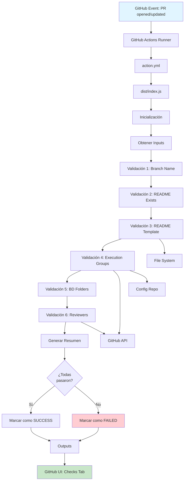
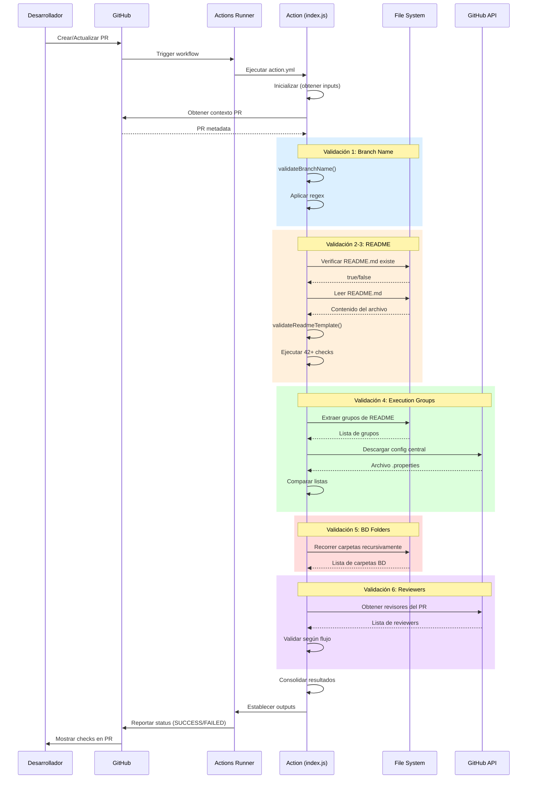
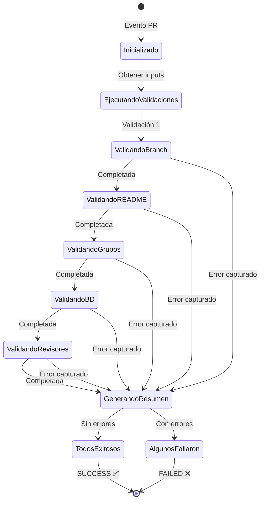

# Documentación Técnica - ESB ACE12 Checklist Validation Action

## 1. Arquitectura del Action

### 1.1 Vista General de la Arquitectura

El **ESB ACE12 Checklist Validation Action** es una aplicación Node.js diseñada para ejecutarse como GitHub Action. La arquitectura sigue un patrón modular con separación clara de responsabilidades.

**Componentes principales:**

```
┌─────────────────────────────────────────────────────────────┐
│                   GitHub Event System                        │
│          (Pull Request: opened, synchronize, etc.)          │
└────────────────────────┬────────────────────────────────────┘
                         │
                         ▼
┌─────────────────────────────────────────────────────────────┐
│                  GitHub Actions Runner                       │
│                     (Ubuntu Latest)                          │
└────────────────────────┬────────────────────────────────────┘
                         │
                         ▼
┌─────────────────────────────────────────────────────────────┐
│               action.yml (Configuración)                     │
│  - Inputs (tokens, configuración)                           │
│  - Outputs (resultados de validación)                       │
│  - Entry point: dist/index.js                               │
└────────────────────────┬────────────────────────────────────┘
                         │
                         ▼
┌─────────────────────────────────────────────────────────────┐
│                  index.js (Orquestador)                      │
│  ┌──────────────────────────────────────────────────────┐  │
│  │              Función run() - Main                    │  │
│  │  1. Obtener inputs                                   │  │
│  │  2. Validar contexto PR                              │  │
│  │  3. Ejecutar validaciones                            │  │
│  │  4. Generar resumen                                  │  │
│  │  5. Reportar resultados                              │  │
│  └──────────────────────────────────────────────────────┘  │
│                                                              │
│  ┌──────────────────────────────────────────────────────┐  │
│  │           Funciones de Validación                    │  │
│  │  • validateBranchName()                              │  │
│  │  • validateReadmeExistence()                         │  │
│  │  • validateReadmeTemplate()                          │  │
│  │  • validateExecutionGroups()                         │  │
│  │  • validateNoBDFolders()                             │  │
│  │  • validateReviewersAndRoutes()                      │  │
│  └──────────────────────────────────────────────────────┘  │
└────────────────────────┬────────────────────────────────────┘
                         │
         ┌───────────────┼───────────────┐
         │               │               │
         ▼               ▼               ▼
┌──────────────┐ ┌──────────────┐ ┌──────────────┐
│  File System │ │  GitHub API  │ │   Regex      │
│  (fs, path)  │ │  (@actions/  │ │   Engine     │
│              │ │   github)    │ │              │
└──────────────┘ └──────────────┘ └──────────────┘
```

### 1.2 Componentes del Sistema

| Componente | Descripción | Responsabilidad |
|------------|-------------|-----------------|
| **action.yml** | Archivo de definición del Action | Define inputs, outputs, branding y entry point |
| **index.js** | Código principal del Action | Orquesta las validaciones y maneja el flujo |
| **dist/index.js** | Código compilado (bundle) | Versión empaquetada con todas las dependencias |
| **package.json** | Configuración de Node.js | Define dependencias y scripts de build |
| **checklist.yml** | Workflow de ejemplo | Define cuándo y cómo ejecutar el Action |

### 1.3 Flujo de Datos

```
Evento PR → Runner → Action → Validaciones → Resultados
                                    ↓
                             • File System
                             • GitHub API
                             • Config Repo
                                    ↓
                         Outputs + Annotations
                                    ↓
                          GitHub UI (Checks)
```

---

## 2. Librerías y Dependencias Utilizadas

### 2.1 Dependencias de Producción

| Librería | Versión | Propósito |
|----------|---------|-----------|
| **@actions/core** | ^1.11.1 | API central de GitHub Actions para inputs, outputs, logging y gestión de errores |
| **@actions/github** | ^6.0.0 | Cliente Octokit para interactuar con la API de GitHub (repositorios, PRs, issues) |

### 2.2 Dependencias de Desarrollo

| Librería | Versión | Propósito |
|----------|---------|-----------|
| **@vercel/ncc** | ^0.38.1 | Compilador para empaquetar el código Node.js y sus dependencias en un solo archivo |

### 2.3 Módulos Nativos de Node.js

| Módulo | Propósito en el Action |
|--------|------------------------|
| **fs** | Lectura de archivos (README.md, .project, estructura de carpetas) |
| **path** | Manipulación de rutas de archivos multiplataforma |

### 2.4 Detalles de @actions/core

**Funciones principales utilizadas:**

```javascript
const core = require('@actions/core');

// Obtener inputs configurados en action.yml
core.getInput('github-token')
core.getInput('config-repo-token')
core.getInput('skip-readme-validation')
core.getInput('valid-reviewers')

// Logging estructurado
core.info('Mensaje informativo')
core.warning('Advertencia')
core.error('Error que no detiene ejecución')
core.debug('Mensaje de debugging')

// Agrupación de logs (colapsables en UI)
core.startGroup('Nombre del grupo')
core.endGroup()

// Establecer outputs
core.setOutput('validation-passed', true)
core.setOutput('results', JSON.stringify(results))

// Marcar el Action como fallido
core.setFailed('Mensaje de error')
```

### 2.5 Detalles de @actions/github

**Funciones principales utilizadas:**

```javascript
const github = require('@actions/github');

// Obtener contexto del evento
const context = github.context;
const payload = context.payload;

// Información del PR
payload.pull_request.number
payload.pull_request.head.ref  // Rama origen
payload.pull_request.base.ref  // Rama destino

// Cliente Octokit para API
const octokit = github.getOctokit(token);

// Llamadas a la API
await octokit.rest.repos.getContent({...})
await octokit.rest.issues.listComments({...})
```

---

## 3. Lógica de Validaciones

### 3.1 Flujo de Ejecución Principal

```javascript
async function run() {
  try {
    // 1. Inicialización
    const token = core.getInput('github-token');
    const configRepoToken = core.getInput('config-repo-token');
    const skipReadmeValidation = core.getInput('skip-readme-validation');
    const workspaceDir = getWorkspaceDir();
    
    // 2. Estructura de resultados
    const results = {
      branchName: null,
      readmeExistence: null,
      readmeTemplate: null,
      executionGroups: null,
      bdFolders: null,
      reviewersAndRoutes: null
    };
    
    // 3. Ejecutar validaciones en secuencia
    //    Cada validación captura su propia excepción
    
    // 4. Generar resumen
    const allPassed = Object.values(results).every(r => r !== false);
    
    // 5. Establecer outputs
    core.setOutput('validation-passed', allPassed);
    core.setOutput('results', JSON.stringify(results));
    
    // 6. Marcar como fallido si hay errores
    if (!allPassed) {
      core.setFailed('❌ Una o más validaciones fallaron');
    }
  } catch (error) {
    core.setFailed(`Error en la ejecución: ${error.message}`);
  }
}
```

### 3.2 Estrategia de Manejo de Errores

Cada validación utiliza el patrón **try-catch individual** para permitir que las demás validaciones se ejecuten incluso si una falla:

```javascript
try {
  results.branchName = await validateBranchName(payload);
  core.info('✅ Nombre de rama válido');
} catch (error) {
  core.error(`❌ ${error.message}`);
  results.branchName = false;
}
```

**Ventajas de este enfoque:**
- ✅ Todas las validaciones se ejecutan independientemente
- ✅ El usuario recibe feedback completo en una sola ejecución
- ✅ No necesita múltiples ciclos de corrección

---

## 4. Validación de Expresiones Regulares en Node.js

### 4.1 Validación de Nombres de Rama

**Ubicación:** `validateBranchName()` en [index.js](index.js#L205-L217)

**Expresión Regular:**
```javascript
const pattern = /^(feature|bugfix|hotfix|release)\/[A-Za-z0-9._-]+$|^(develop|quality|main)$/;
```

**Desglose:**
- `^(feature|bugfix|hotfix|release)\/` - Inicia con uno de estos prefijos seguido de `/`
- `[A-Za-z0-9._-]+` - Seguido de uno o más caracteres alfanuméricos, puntos, guiones bajos o guiones
- `$` - Fin de la cadena
- `|^(develop|quality|main)$` - O es exactamente una de las ramas principales

**Ejemplos válidos:**
- `feature/nueva-funcionalidad`
- `bugfix/correccion-error`
- `hotfix/seguridad-critica`
- `release/v1.2.0`
- `develop`, `quality`, `main`

**Ejemplos inválidos:**
- `fix-bug` (sin prefijo)
- `feature/` (sin nombre después del slash)
- `feature-nueva` (guion en lugar de slash)

### 4.2 Validación de Título del README

**Expresión Regular:**
```javascript
const titleMatch = content.match(/^#\s*ESB_(.+)$/m);
```

**Desglose:**
- `^#` - Comienza con marcador de título Markdown nivel 1
- `\s*` - Espacios opcionales
- `ESB_` - Texto literal
- `(.+)` - Captura uno o más caracteres (nombre del servicio)
- `$` - Fin de línea
- `m` flag - Modo multilínea

**Validación adicional:**
```javascript
if (!titleMatch[1] || titleMatch[1].trim() === '' || 
    /^[_-]+\.?$/.test(titleMatch[1].trim())) {
  // Error: título inválido
}
```

Rechaza títulos que sean solo guiones o guiones bajos.

### 4.3 Validación de URLs de DataPower

**Patrón para Desarrollo:**
```javascript
/^https:\/\/boc201\.des\.app\.bancodeoccidente\.net/i
```

**Patrón para Calidad (Externo):**
```javascript
/^https:\/\/boc201\.tesdmz\.app\.bancodeoccidente\.net/i
```

**Patrón para Calidad (Interno):**
```javascript
/^https:\/\/boc201\.tesint\.app\.bancodeoccidente\.net/i
```

**Patrón para Producción (Externo):**
```javascript
/^https:\/\/boc201\.prddmz\.app\.bancodeoccidente\.net/i
```

**Patrón para Producción (Interno):**
```javascript
/^https:\/\/boc201\.prdint\.app\.bancodeoccidente\.net/i
```

### 4.4 Validación de Endpoints BUS

**Desarrollo:**
```javascript
/^https?:\/\/adbog162e/i
```

**Calidad:**
```javascript
/^https?:\/\/a[dt]bog16[34][de]/i
```
Acepta: atbog163d, atbog164e, adbog163e, adbog164d

**Producción:**
```javascript
/^https?:\/\/apbog16[56][ab]/i  // apbog165a, apbog165b, apbog166a, apbog166b
// O alternativa:
/^https?:\/\/boc060ap\.prd\.app/
```

### 4.5 Validación de Rutas Git

**Patrón flexible (acepta slash y backslash):**
```javascript
const gitPatternBackslash = new RegExp(`git\\\\${repo_name}\\\\Broker\\\\WSDL`, 'i');
const gitPatternForwardslash = new RegExp(`git/${repo_name}/Broker/WSDL`, 'i');
```

Acepta ambos formatos:
- `git\ESB_ServicioX\Broker\WSDL`
- `git/ESB_ServicioX/Broker/WSDL`

---

## 5. Validaciones Existentes

### 5.1 Número Total de Validaciones

El Action implementa **6 validaciones principales** con **múltiples sub-validaciones**:

| # | Validación Principal | Sub-validaciones | Total Checks |
|---|---------------------|------------------|--------------|
| 1 | Nombre de Rama | 1 | 1 |
| 2 | Existencia README | 1 | 1 |
| 3 | Plantilla README | 42+ | ~50 |
| 4 | Grupos de Ejecución | 3 | 3 |
| 5 | Carpetas BD | 1 | 1 |
| 6 | Revisores y Rutas | 5 | 5 |
| **TOTAL** | **6** | **53+** | **~61** |

### 5.2 Detalle de cada Validación

#### 5.2.1 Validación de Nombre de Rama

**Función:** `validateBranchName(payload)`

**Qué valida:**
- Que el nombre de la rama siga convención GitFlow
- Prefijos permitidos: `feature/`, `bugfix/`, `hotfix/`, `release/`
- Ramas principales permitidas: `develop`, `quality`, `main`

**Resultado:**
- ✅ `true` si cumple
- ❌ Lanza excepción con mensaje descriptivo

---

#### 5.2.2 Validación de Existencia de README

**Función:** `validateReadmeExistence(workspaceDir)`

**Qué valida:**
- Que exista el archivo `README.md` en la raíz del repositorio

**Implementación:**
```javascript
const readmePath = path.join(workspaceDir, 'README.md');
if (!fs.existsSync(readmePath)) {
  throw new Error('No se encontró el archivo README.md');
}
```

---

#### 5.2.3 Validación de Plantilla README (La más compleja)

**Función:** `validateReadmeTemplate(workspaceDir)`

**Estrategia:** Acumula errores y avisos, reporta al final

**Sub-validaciones (42+):**

| Sección | Checks | Descripción |
|---------|--------|-------------|
| **Título Principal** | 2 | Existe '# ESB_' y tiene contenido después |
| **Secciones Requeridas** | 7 | Verifica presencia de 7 secciones principales |
| **URLs boc200** | 1 | Detecta uso incorrecto de boc200 (debe ser boc201) |
| **Información del Servicio** | 6 | Descripción, tabla último despliegue, celdas completas |
| **Procedimiento Despliegue** | 2 | Sección existe y tiene contenido |
| **DataPower Externo** | 4 | Tabla con 3 ambientes, validación de URLs por ambiente |
| **DataPower Interno** | 4 | Tabla con 3 ambientes, validación de URLs por ambiente |
| **Endpoint BUS** | 4 | Tabla con 3 ambientes, validación de nodos por ambiente |
| **Canales-Aplicaciones** | 2 | Filas Consumidor y Backends con contenido |
| **Dependencias** | 3 | Tabla Servicios, tabla XSL, coincidencia con .project |
| **Documentación** | 6 | Diseño detallado, Mapeo, Evidencias, WSDL/SWAGGER/JSON |
| **SQL** | 2 | Sección existe, queries con códigos numéricos |

**Total:** ~43 validaciones individuales

**Ejemplo de validación compleja (DataPower por ambiente):**

```javascript
if (/^DESARROLLO/i.test(ambiente)) {
  // Validar sufijo DEV en DataPower
  if (!/^BODP.*DEV$/i.test(datapower)) {
    errors.push('Datapower en DESARROLLO debe terminar con DEV');
  }
  // Validar endpoint de desarrollo
  if (!/^https:\/\/boc201\.des\.app/i.test(endpoint)) {
    errors.push('Endpoint en DESARROLLO debe usar boc201.des.app');
  }
}
```

---

#### 5.2.4 Validación de Grupos de Ejecución

**Función:** `validateExecutionGroups(token, workspaceDir)`

**Qué valida:**
- Extrae nombre del servicio del README
- Extrae grupos del README (sección "Procedimiento de despliegue")
- Descarga configuración central desde `ESB_ACE12_General_Configs`
- Compara grupos del README vs configuración central
- Reporta diferencias (faltantes en README o extras no configurados)

**Flujo:**
1. Extraer servicio: `ESB_ACE12_NombreServicio`
2. Buscar grupos en README después de "desplegar en los grupos de ejecución:"
3. Descargar archivo `esb-ace12-general-integration-servers.properties`
4. Buscar líneas `ESB_ACE12_NombreServicio.Transactional=...`
5. Buscar líneas `ESB_ACE12_NombreServicio.Notification=...`
6. Comparar listas

**Implementación de descarga:**
```javascript
const octokit = github.getOctokit(token);
const response = await octokit.rest.repos.getContent({
  owner: 'bocc-principal',
  repo: 'ESB_ACE12_General_Configs',
  path: 'ace-12-common-properties/esb-ace12-general-integration-servers.properties',
  ref: 'main'
});
const configContent = Buffer.from(response.data.content, 'base64').toString('utf8');
```

---

#### 5.2.5 Validación de Carpetas BD

**Función:** `validateNoBDFolders(workspaceDir)`

**Qué valida:**
- Recorre recursivamente todas las carpetas del repositorio
- Busca carpetas con nombre "BD" (case-insensitive)
- Excluye la carpeta `.git` del análisis

**Implementación:**
```javascript
const findBDFolders = (dir, results = []) => {
  const entries = fs.readdirSync(dir, { withFileTypes: true });
  
  for (const entry of entries) {
    if (entry.name === '.git') continue;
    const fullPath = path.join(dir, entry.name);
    
    if (entry.isDirectory()) {
      if (entry.name.toLowerCase() === 'bd') {
        results.push(fullPath);
      }
      findBDFolders(fullPath, results); // Recursión
    }
  }
  return results;
};
```

---

#### 5.2.6 Validación de Revisores y Rutas

**Función:** `validateReviewersAndRoutes(payload, token)`

**Qué valida:**
- Extrae rama origen y destino del PR
- Verifica flujos críticos que requieren revisores autorizados
- Normaliza nombres de revisores (elimina sufijos como `_bocc`)
- Permite excepciones de emergencia (comentario `@bot aprobar excepción`)

**Flujos validados:**

| Flujo | Requiere Revisor | Criticidad |
|-------|------------------|------------|
| develop → quality | ✅ Sí | Alta |
| quality → main | ✅ Sí | Crítica |
| main → quality | ✅ Sí | Alta (rollback) |
| quality → develop | ✅ Sí | Media (rollback) |
| feature → develop | ⚠️ Opcional | Baja |
| Otros | ❌ No | N/A |

**Revisores autorizados por defecto:**
- DRamirezM
- cdgomez
- acardenasm
- CAARIZA
- JJPARADA

**Normalización de nombres:**
```javascript
const normalizeReviewer = (name) => {
  return name.replace(/_bocc$/i, '').trim();
};
```

Permite que `DRamirezM` y `DRamirezM_bocc` sean considerados equivalentes.

---

## 6. Ubicación del Código

### 6.1 Estructura de Carpetas del Repositorio

```
testsd/
├── .github/
│   └── workflows/
│       └── checklist.yml          # Workflow que ejecuta el Action
│
├── action.yml                     # Definición del Action
├── index.js                       # Código principal (Entry point)
├── package.json                   # Dependencias y scripts
├── package-lock.json              # Lockfile de dependencias
│
├── dist/                          # Código compilado
│   └── index.js                   # Bundle generado por ncc
│
├── test/                          # Tests del Action
│   ├── test_all_readmes.js
│   ├── test_readme_real.js
│   ├── test_full_flow.js
│   └── (otros tests...)
│
├── bancos readme a evaluar/       # READMEs de ejemplo/test
│   └── (archivos README de prueba)
│
├── CHECKLIST.md                   # Documentación de checklist
├── README.md                      # Documentación principal
│
└── DOCUMENTACION_FUNCIONAL.md     # Este documento
└── DOCUMENTACION_TECNICA.md       # Este documento
```

### 6.2 Ubicación de las Validaciones

| Validación | Ubicación en index.js | Líneas Aproximadas |
|------------|----------------------|-------------------|
| `run()` - Orquestador | [index.js](index.js#L17-L180) | 17-180 |
| `validateBranchName()` | [index.js](index.js#L205-L217) | 205-217 |
| `validateReadmeExistence()` | [index.js](index.js#L223-L233) | 223-233 |
| `validateReadmeTemplate()` | [index.js](index.js#L239-L1078) | 239-1078 |
| `validateExecutionGroups()` | [index.js](index.js#L1117-L1263) | 1117-1263 |
| `validateNoBDFolders()` | [index.js](index.js#L1084-L1111) | 1084-1111 |
| `validateReviewersAndRoutes()` | [index.js](index.js#L1269-L1453) | 1269-1453 |

### 6.3 Archivos Clave

**action.yml** - Define el Action
```yaml
name: 'ESB ACE12 Checklist Validation'
description: 'Validates ESB/ACE12 service repositories...'
inputs:
  github-token: ...
  config-repo-token: ...
  skip-readme-validation: ...
  valid-reviewers: ...
outputs:
  validation-passed: ...
  results: ...
runs:
  using: 'node20'
  main: 'dist/index.js'
```

**package.json** - Configuración Node.js
```json
{
  "name": "esb-ace12-checklist-action",
  "version": "1.0.0",
  "main": "index.js",
  "scripts": {
    "build": "ncc build index.js -o dist",
    "test": "node index.js"
  },
  "dependencies": {
    "@actions/core": "^1.11.1",
    "@actions/github": "^6.0.0"
  }
}
```

---

## 7. Diagramas

### 7.1 Diagrama de Arquitectura



### 7.2 Diagrama de Secuencia del Action



### 7.3 Diagrama de Flujo de Validación README

```mermaid
flowchart TD
    Start([Inicio validateReadmeTemplate]) --> ReadFile[Leer README.md]
    ReadFile --> InitArrays[Inicializar arrays:<br/>notices = []<br/>errors = []]
    
    InitArrays --> V1[Validar Título Principal]
    V1 --> V2[Validar Secciones Requeridas]
    V2 --> V3[Validar URLs boc200]
    V3 --> V4[Validar Información del Servicio]
    V4 --> V5[Validar Procedimiento Despliegue]
    V5 --> V6[Validar DataPower Externo/Interno]
    V6 --> V7[Validar Endpoint BUS]
    V7 --> V8[Validar Canales-Aplicaciones]
    V8 --> V9[Validar Dependencias]
    V9 --> V10[Validar Documentación]
    V10 --> V11[Validar SQL]
    
    V11 --> Check{¿Hay<br/>errores?}
    
    Check -->|Sí| LogErrors[Registrar todos los errores]
    LogErrors --> ThrowError[Lanzar excepción con resumen]
    ThrowError --> End([Fin - FAILED])
    
    Check -->|No| LogSuccess[Registrar éxito]
    LogSuccess --> ReturnTrue[return true]
    ReturnTrue --> End2([Fin - SUCCESS])
    
    style Start fill:#e1f5ff
    style End fill:#ffcdd2
    style End2 fill:#c8e6c9
    style Check fill:#fff9c4
```

### 7.4 Diagrama de Estados del Action



### 7.5 Diagrama de Componentes y Dependencias

```mermaid
graph LR
    subgraph "GitHub Actions Environment"
        A[action.yml]
        B[dist/index.js]
    end
    
    subgraph "Node.js Application"
        C[index.js Entry Point]
        D[validateBranchName]
        E[validateReadmeExistence]
        F[validateReadmeTemplate]
        G[validateExecutionGroups]
        H[validateNoBDFolders]
        I[validateReviewersAndRoutes]
    end
    
    subgraph "Dependencies"
        J[@actions/core]
        K[@actions/github]
        L[fs native]
        M[path native]
    end
    
    subgraph "External Resources"
        N[GitHub API]
        O[Config Repo]
        P[Workspace Files]
    end
    
    A --> B
    B --> C
    C --> D
    C --> E
    C --> F
    C --> G
    C --> H
    C --> I
    
    D --> J
    E --> L
    E --> M
    F --> L
    F --> M
    F --> J
    G --> K
    G --> N
    G --> O
    H --> L
    I --> K
    I --> N
    
    style A fill:#e1f5ff
    style B fill:#fff9c4
    style C fill:#c8e6c9
```

---

## 8. Proceso de Build y Deployment

### 8.1 Compilación del Action

El Action utiliza `@vercel/ncc` para empaquetar todo el código y dependencias en un solo archivo.

**Comando de build:**
```bash
npm run build
```

**Proceso interno:**
```bash
ncc build index.js -o dist
```

**Resultado:**
- Genera `dist/index.js` (archivo único con todo incluido)
- Incluye todas las dependencias de `node_modules`
- Optimiza y minimiza el código
- Elimina dependencias no utilizadas

**¿Por qué empaquetar?**
- ✅ No requiere `npm install` en el runner
- ✅ Ejecución más rápida (sin descarga de dependencias)
- ✅ Versionamiento limpio (un solo archivo en git)
- ✅ Evita problemas de dependencias faltantes

### 8.2 Versionamiento y Releases

**Flujo recomendado:**

1. **Desarrollo:**
   ```bash
   # Hacer cambios en index.js
   npm run build
   git add dist/index.js
   git commit -m "feat: nueva validación X"
   git push
   ```

2. **Crear release:**
   ```bash
   git tag v1.2.0
   git push origin v1.2.0
   ```

3. **Uso en workflows:**
   ```yaml
   - uses: bocc-principal/esb-ace12-checklist-action@v1.2.0
   # O usar rama main para latest:
   - uses: bocc-principal/esb-ace12-checklist-action@main
   ```

### 8.3 Testing Local

**Ejecutar action localmente:**
```bash
# Simular ejecución (sin contexto de PR real)
node index.js
```

**Variables de entorno necesarias:**
```bash
export GITHUB_WORKSPACE=/path/to/test/repo
export INPUT_GITHUB-TOKEN=ghp_xxxxx
export INPUT_CONFIG-REPO-TOKEN=ghp_yyyyy
export INPUT_SKIP-README-VALIDATION=false

node index.js
```

**Tests automatizados:**
```bash
# Ejecutar suite de tests
node test/test_all_readmes.js
node test/test_readme_real.js
node test/test_full_flow.js
```

---

## 9. Consideraciones de Seguridad

### 9.1 Gestión de Tokens

**Tokens utilizados:**

| Token | Propósito | Alcance Requerido |
|-------|-----------|-------------------|
| `github.token` | Acceso al PR actual | `contents: read`, `pull-requests: read` |
| `CONFIG_REPO_TOKEN` | Acceso a repo de configuración | `repo` (lectura de repositorio privado) |

**Buenas prácticas:**
- ❌ **NUNCA** imprimir tokens en logs
- ✅ Usar `core.setSecret()` si es necesario manejar valores sensibles
- ✅ Verificar permisos mínimos necesarios
- ✅ Rotar tokens periódicamente

**Implementación en el código:**
```javascript
const token = core.getInput('github-token') || process.env.GITHUB_TOKEN;
// NO hacer: console.log(token)
core.info(`GitHub token: ${token ? '✅ Provided' : '❌ Not provided'}`);
```

### 9.2 Validación de Inputs

**Sanitización:**
```javascript
// Normalizar revisores (eliminar espacios, convertir a minúsculas)
const validReviewers = validReviewersInput
  .split(',')
  .map(r => r.trim().toLowerCase());

// Validar booleanos
const skipReadmeValidation = core.getInput('skip-readme-validation') === 'true';
```

### 9.3 Prevención de Ataques de Path Traversal

**Protección:**
```javascript
// Usar path.join para construir rutas
const readmePath = path.join(workspaceDir, 'README.md');

// Verificar que la ruta resultante esté dentro del workspace
if (!readmePath.startsWith(workspaceDir)) {
  throw new Error('Invalid path');
}
```

---

## 10. Troubleshooting y Debugging

### 10.1 Problemas Comunes

#### Error: "No module found '@actions/core'"

**Causa:** El `dist/index.js` no está actualizado

**Solución:**
```bash
npm install
npm run build
git add dist/index.js
git commit -m "chore: rebuild dist"
git push
```

#### Error: "Bad credentials" en descarga de config

**Causa:** Token de configuración inválido o sin permisos

**Solución:**
1. Verificar que el secret `CONFIG_REPO_TOKEN` existe
2. Regenerar el token con alcance `repo`
3. Actualizar el secret en GitHub

#### Error: "ENOENT: no such file or directory 'README.md'"

**Causa:** El archivo no existe o el workspace no está correcto

**Solución:**
```yaml
# Asegurar checkout antes de ejecutar el action
- uses: actions/checkout@v3
- uses: ./  # O la ruta al action
```

### 10.2 Habilitar Debug Logging

**En el workflow:**
```yaml
env:
  ACTIONS_STEP_DEBUG: true
```

**En el código:**
```javascript
core.debug('Este mensaje solo aparece en modo debug');
```

**Ver logs de debug:**
1. Re-ejecutar el Action
2. Ver logs expandidos en la pestaña "Checks"

### 10.3 Testing de Regex

**Herramienta inline:**
```javascript
// Agregar temporalmente en validateReadmeTemplate()
core.info(`Testing regex on: ${testString}`);
const match = testString.match(/your-regex-here/);
core.info(`Match result: ${JSON.stringify(match)}`);
```

---

## 11. Extensión y Mantenimiento

### 11.1 Agregar una Nueva Validación

**Pasos:**

1. **Crear función de validación:**
```javascript
async function validateNuevaFuncionalidad(workspaceDir) {
  // Lógica de validación
  if (/* condición de error */) {
    throw new Error('Mensaje descriptivo del error');
  }
  return true;
}
```

2. **Integrar en run():**
```javascript
// Agregar en results
const results = {
  // ... existentes
  nuevaFuncionalidad: null
};

// Agregar try-catch
try {
  results.nuevaFuncionalidad = await validateNuevaFuncionalidad(workspaceDir);
  core.info('✅ Nueva funcionalidad válida');
} catch (error) {
  core.error(`❌ ${error.message}`);
  results.nuevaFuncionalidad = false;
}
```

3. **Actualizar resumen:**
```javascript
core.info(`  - Nueva funcionalidad: ${results.nuevaFuncionalidad !== false ? '✅' : '❌'}`);
```

4. **Rebuild y test:**
```bash
npm run build
node index.js  # Test local
```

### 11.2 Modificar Validación Existente

**Ejemplo: Cambiar patrón de branch:**

```javascript
// ANTES
const pattern = /^(feature|bugfix|hotfix|release)\/[A-Za-z0-9._-]+$/;

// DESPUÉS (agregar 'epic')
const pattern = /^(feature|bugfix|hotfix|release|epic)\/[A-Za-z0-9._-]+$/;
```

**Rebuild y desplegar:**
```bash
npm run build
git add dist/index.js index.js
git commit -m "feat: agregar soporte para ramas epic/"
git push
```

### 11.3 Mantener Compatibilidad

**Principios:**
- ✅ Mantener backward compatibility en outputs
- ✅ Deprecar features con warnings antes de eliminar
- ✅ Versionar cambios breaking (v1.x → v2.x)
- ✅ Documentar cambios en CHANGELOG.md

---

## 12. Métricas y Monitoreo

### 12.1 Métricas Disponibles

El Action reporta métricas implícitas via GitHub Actions:

- **Tasa de éxito**: Porcentaje de PRs que pasan todas las validaciones
- **Tiempo de ejecución**: Duración promedio del Action
- **Validaciones más falladas**: Identificar patrones de errores comunes

**Obtener métricas:**
1. GitHub UI → Actions → Checklist workflow
2. Ver historial de ejecuciones
3. Analizar patrones de fallos

### 12.2 Outputs Estructurados

El Action genera outputs JSON estructurados:

```json
{
  "branchName": true,
  "readmeExistence": true,
  "readmeTemplate": false,
  "executionGroups": true,
  "bdFolders": true,
  "reviewersAndRoutes": true
}
```

**Uso en workflows subsecuentes:**
```yaml
- name: Run validation
  id: validate
  uses: ./

- name: Process results
  if: always()
  run: |
    echo "Passed: ${{ steps.validate.outputs.validation-passed }}"
    echo "Details: ${{ steps.validate.outputs.results }}"
```

---

## 13. Referencias Técnicas

### 13.1 Documentación Oficial

- **GitHub Actions:** https://docs.github.com/en/actions
- **@actions/core:** https://github.com/actions/toolkit/tree/main/packages/core
- **@actions/github:** https://github.com/actions/toolkit/tree/main/packages/github
- **Octokit REST API:** https://octokit.github.io/rest.js/

### 13.2 Estándares Aplicados

- **GitFlow:** https://nvie.com/posts/a-successful-git-branching-model/
- **Semantic Versioning:** https://semver.org/
- **Node.js Best Practices:** https://github.com/goldbergyoni/nodebestpractices

### 13.3 Herramientas Recomendadas

- **Regex Testing:** https://regexr.com/, https://regex101.com/
- **Markdown:** https://spec.commonmark.org/
- **Mermaid Diagrams:** https://mermaid.js.org/

---

## 14. Contacto y Contribución

**Equipo de Desarrollo:**
- Banco de Occidente - ESB Team

**Maintainers:**
- DRamirezM
- cdgomez
- acardenasm
- CAARIZA

**Para contribuir:**
1. Fork del repositorio
2. Crear branch `feature/mejora-x`
3. Desarrollar y probar localmente
4. Crear PR con descripción detallada
5. Esperar revisión del equipo ESB

**Reportar bugs:**
- Crear issue en el repositorio
- Incluir logs completos del Action
- Descripción del comportamiento esperado vs actual
- Pasos para reproducir

---

**Versión:** 1.0  
**Fecha:** Marzo 2026  
**Autor:** Banco de Occidente - ESB Team

---

## Anexo A: Tabla Completa de Validaciones README

| # | Validación | Tipo | Descripción |
|---|-----------|------|-------------|
| 1 | Título principal existe | Obligatorio | Verifica `# ESB_` |
| 2 | Título principal tiene contenido | Obligatorio | No puede ser solo `ESB_` |
| 3 | Sección INFORMACIÓN DEL SERVICIO | Obligatorio | Header debe existir |
| 4 | Contenido antes de subsecciones | Obligatorio | Descripción del servicio |
| 5 | Subsección Último despliegue | Obligatorio | `### Último despliegue` |
| 6 | Tabla Último despliegue formato | Obligatorio | Encabezado CQ, JIRA, Fecha |
| 7 | Tabla Último despliegue datos | Obligatorio | Al menos una fila con datos |
| 8 | Celdas Último despliegue completas | Obligatorio | Sin celdas vacías |
| 9 | Sección Procedimiento despliegue | Obligatorio | `## Procedimiento de despliegue` |
| 10 | Contenido Procedimiento despliegue | Obligatorio | No puede estar vacía |
| 11 | Sección ACCESO AL SERVICIO | Obligatorio | `## ACCESO AL SERVICIO` |
| 12 | DataPower Externo o Interno | Obligatorio | Al menos una subsección |
| 13 | DP Externo - Tabla existe | Condicional | Si no es NA |
| 14 | DP Externo - Fila DESARROLLO | Obligatorio | Puede ser NA |
| 15 | DP Externo - Fila CALIDAD | Obligatorio | Puede ser NA |
| 16 | DP Externo - Fila PRODUCCION | Obligatorio | Puede ser NA |
| 17 | DP Externo - Datapower DEV termina DEV | Condicional | Si no es NA |
| 18 | DP Externo - Endpoint DEV usa boc201.des | Condicional | Si no es NA |
| 19 | DP Externo - Datapower QAS termina QAS | Condicional | Si no es NA |
| 20 | DP Externo - Endpoint QAS usa boc201.tesdmz | Condicional | Si no es NA |
| 21 | DP Externo - Datapower PRD termina PRD | Condicional | Si no es NA |
| 22 | DP Externo - Endpoint PRD usa boc201.prddmz | Condicional | Si no es NA |
| 23-34 | DP Interno - (mismas reglas que Externo) | Condicional | Con URLs tesint/prdint |
| 35 | Subsección Endpoint BUS | Obligatorio | `### Endpoint BUS` |
| 36 | Tabla Endpoint BUS tiene datos | Obligatorio | Al menos una fila |
| 37 | Endpoint BUS - Fila DESARROLLO | Obligatorio | No puede ser NA |
| 38 | Endpoint BUS - Fila CALIDAD | Obligatorio | No puede ser NA |
| 39 | Endpoint BUS - Fila PRODUCCION | Obligatorio | No puede ser NA |
| 40 | Endpoint BUS DEV usa adbog162e | Obligatorio | Nodo correcto |
| 41 | Endpoint BUS QAS usa nodos calidad | Obligatorio | atbog163/164 o adbog163/164 |
| 42 | Endpoint BUS PRD usa nodos prod | Obligatorio | apbog165/166 o boc060ap |
| 43 | Sección CANALES - APLICACIONES | Obligatorio | `## CANALES - APLICACIONES` |
| 44 | Fila Consumidor existe | Obligatorio | `**Consumidor**` |
| 45 | Fila Consumidor tiene valores | Obligatorio | No puede estar vacía |
| 46 | Fila Backends existe | Obligatorio | `**Backends**` |
| 47 | Fila Backends tiene valores | Obligatorio | No puede estar vacía |
| 48 | Sección DEPENDENCIAS | Obligatorio | `## DEPENDENCIAS` |
| 49 | Tabla Servicios existe | Obligatorio | Entre `Servicios` y `XSL` |
| 50 | Servicios coinciden con .project | Obligatorio | Sincronización |
| 51 | Tabla XSL existe | Obligatorio | Después de Servicios |
| 52 | Tabla XSL tiene contenido | Obligatorio | Datos o NA explícito |
| 53 | Sección DOCUMENTACION | Obligatorio | `## DOCUMENTACION` |
| 54 | Campo Documento de diseño | Obligatorio | Con link SharePoint |
| 55 | Campo Mapeo | Obligatorio | Con link SharePoint |
| 56 | Campo Evidencias | Obligatorio | Con link SharePoint |
| 57 | Campo WSDL, SWAGGER o JSON | Obligatorio | Al menos uno |
| 58 | WSDL ruta correcta | Condicional | git/REPO/Broker/WSDL o NA |
| 59 | SWAGGER ruta correcta | Condicional | git/REPO/Broker/SWAGGER o NA |
| 60 | JSON ruta correcta | Condicional | git/REPO/Broker/JSON o NA |
| 61 | Sección SQL | Obligatorio | `## SQL` |
| 62 | SQL tiene contenido | Obligatorio | No puede estar vacía |
| 63 | SQL queries con códigos numéricos | Obligatorio | Solo dígitos en códigos operación |
| 64 | No usar boc200 | Crítico | Debe ser boc201 |

**Total: 64 validaciones individuales** (algunas condicionales basadas en el tipo de servicio)

---

## Anexo B: Códigos de Salida

| Código | Significado | Acción |
|--------|-------------|--------|
| 0 | Éxito (todas las validaciones pasaron) | Continue workflow |
| 1 | Fallo (una o más validaciones fallaron) | Bloquear merge |
| 2 | Error de ejecución (throw genérico) | Revisar logs |

---

**Fin de la Documentación Técnica**
